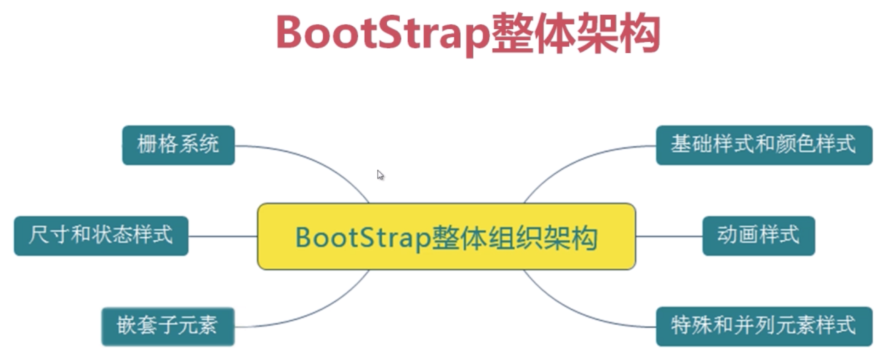

## bootstrap栅格布局

## 认识Bootstrap
</img>

## 栅格化布局详解

### 认识栅格化布局

### 栅格化布局(一)
- row 默认为12列
- col-md-1 占一个格子
- col-md-5 占5个格子
- col-md-push-4 从右往左空4个格子
- col-md-offset-3 从左往右空三个格子

### 栅格化布局(二)

## 实战案例

### 栅格布局(一)

### 栅格布局案例(二)

### 栅格布局案例(三)

### 栅格布局案例(四)
