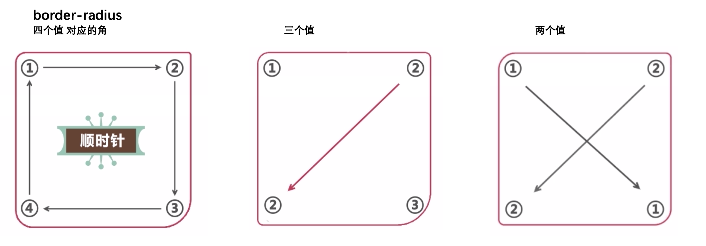

### CSS3圆角
#### border-radius

</img>

### 盒阴影

#### box-shadow
- 语法
>box-shadow:h-shadow v-shadow blur spread color inset;
>
>水平移动  垂直移动  模糊  扩展(向四边)  颜色  内阴影

模糊不可以有负值, 扩展可以有负值,可以使用盒子阴影画一个月亮🌛

### border-image 来编辑可扩展的按钮
- border-image :source slice width outset repeat
只能兼容firefox 和 chrome 和safari6.0以上

>border-image-source
>
>border-image-slice
>
>border-image-width
>
>border-image-outset
>
>border-image-repeat
