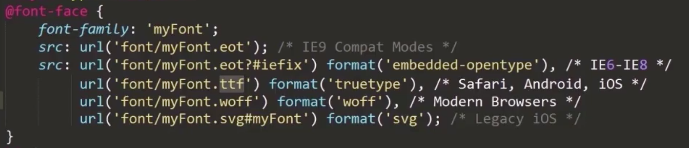

## CSS3文本

### 文本阴影(text-shadow)

>text-shadow:h-shadow v-shadow blur color
>
>text-shadow:水平便宜 垂直便宜 模糊距离 颜色

>text-outline:thickness blur color 规定文本轮廓
>
>text-outline:文本粗细 模糊 颜色 <==任何主流浏览器都不支持

### 换行(word-break和word-wrap)

>word-break:normal | break-all | keep-all
>
>word-break:默认换行格式 不考虑单词完整性该换行就换行 空格或连字符处换行

>word-wrap:normal | break-word
>
>允许长单词或URL地址换行到下一行  只针对拉丁文

### 新文本属性(text-align-last 和 text-overflow)

> text-align-last: left | right | center | justify

> text-overflow:clip | ellipsis | string 文本溢出时使用


## CSS3字体

### @font-face语法规则
```
  @font-face{
    font-family: yourFontName;
    src: path;
    [font-weight:;]
    [font-style:;]
  }
```


### @font-face取值说明

### @font-face字体格式
- .ttf(trueType)
- .otf(OpenType)
- .woff(Web Open Font Format) web的最佳格式 ttf/otf压缩版本
- .eot IE专用字体
- .svg 一种矢量图字体 IE 火狐 不兼容


### @font-face字体应用

最少得有两种字体 兼容所有浏览器

</img>

例:
</img>


### @font-face获取特殊字体

#### Fontsquirrel
- https://www.fontsquirrel.com/tools/webfont-generator
