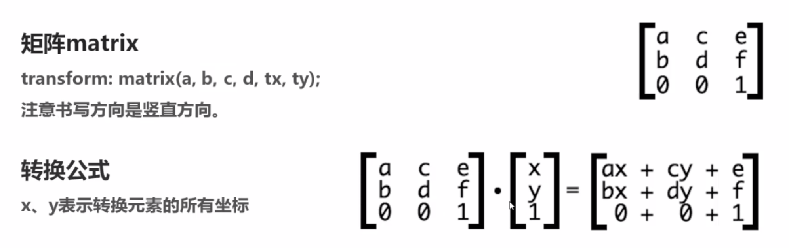
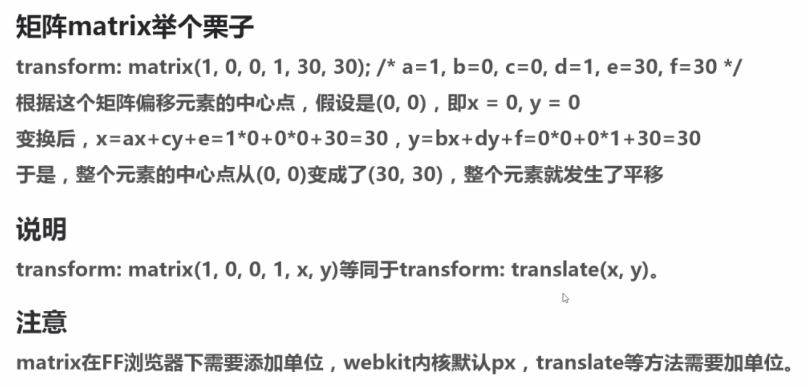

## transform的2D转换

### rotate 旋转
>transform:rotate(+/-角度) + 顺时针 / - 逆时针
>
>transform:rotate(30deg);

### translate 平移
>transform:translateX(20px/%/em/vw/vh)
>
>transform:translateY(20px/%/em/vw/vh)
>
>transform:translate(100px,200px)

### scale 缩放
scale的中线是父级元素中间的水平线/垂直线

>scaleX(.5 or 1.5 or 1)  基准 1 = 100%
>
>scaleY
>
>scale() 两个参数 x y 分别缩放    一个参数时 x y 等比同时缩放,保障图片不变形
>
>例:transform:sacle(.5)

### skew 扭曲或斜切
>transform:skewX()
>
>transform:skewY()
>
>transform:skew(x,y) 一个参数,第二个参数默认为0

## transform的3D转换

### rotate3D
>transform:rotateX()
>
>transform:rotateY()
>
>transform:rotateZ()
>
>transform:rotate3D(x,y,z,angle) 参数不允许省略

### translate3d
>translateZ
>
>transform:translate3d(x,y,z)

### scale3D
>transform:scaleZ()
>
>transform:scale3d(x,y,z)
>
>transform:scale3d(.5,.5,.5)

## transform与坐标系统
- transform-origin:right top 左上角的点
- transform-origin:20% top 顶端 靠右20%左右处

## CSS3矩阵
</img>
</img>

### 矩阵理论

### 矩阵实战

### 3D矩阵

## 扩展属性

### transform-style

### perspective

### backface-visibility
