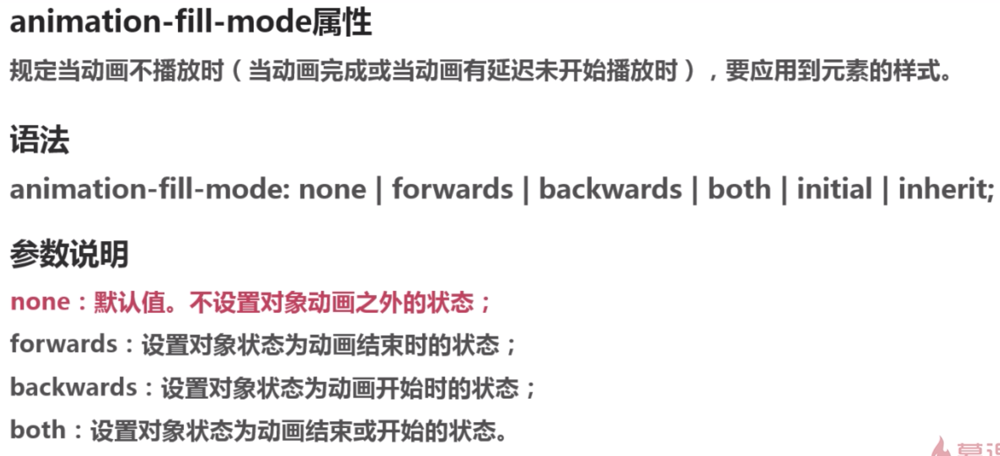

## 过渡 transition属性详解

### transition-property属性

### transition-duration属性

### transition-timing-function属性

### transition-delay属性

## transition综合实例

### transition简写

## 动画原理

## animation属性详解
- 手机设备的浏览器在使用CSS3动画时,要加上 -webkit- 前缀

### animation-name
- animation-name:keyframename | none;

要和 @keyframenames 配合使用

### animation-duration
- animation-duration:time;

```
<!DOCTYPE html>
<html lang="en">
<head>
    <meta charset="UTF-8">
    <title>2-2</title>
    <style type="text/css">
        div {
            font-family: 'Microsoft Yahei';
            font-size: 60px;
            font-weight: bold;
            line-height: 600px;
            position: absolute;
            top: 0;
            right: 0;
            bottom: 0;
            left: 0;
            width: 800px;
            height: 600px;
            margin: auto;
            text-align: center;
            border: 5px solid #000;
            border-radius: 50%;
            /*此处写代码*/
            animation-name:coming;
            -webkit-animation-name:coming;
            animation-duration:2s;
            -webkit-animation-duration:2s;
        }
            @keyframes coming{
            from{opacity:0;}
            to{opacity:1;}
       }
   </style>
</head>
<body>
    <div>大家好，欢迎来到慕课网！</div>
</body>
</html>

```

### animation-timing-function

>animation-timing-function:linear | ...

</img>


### animation-delay
> animation-delay:5s
>
> 定义animation开始前等待的时间

### animation-iteration-count
设置动画循环次数
- animation-iteration-count:infinite | <number>


### animation-direction
</img>

### animation-fill-mode
</img>
### animation-paly-state
</img>
### animation
</img>
```
<!DOCTYPE html>
<html lang="en">
<head>
    <meta charset="UTF-8">
    <title>2-9</title>
    <style type="text/css">
        div {
            font-family: Arial;
            font-size: 72px;
            font-weight: bold;
            position: fixed;
            right: 0;
            left: 0;
            width: 30px;
            height: 30px;
            margin: auto;
            /*此处写代码*/
            transform:rotate(90deg);
            position:absolute;
            top:80%;
            left:50%;
            margin-left:-10px;
            animation-name:slide;
            animation-duration:1.5s;
            animation-iteration-count:infinite;
            animation-delay:.5s;
        }

        @keyframes slide{
            10%{bottom:15%;}
            50%{bottom:10%;}
            60%{bottom:12%;}
            100%{bottom:0%;}

        }

    </style>
</head>
<body>
    <div>&gt;</div>
</body>
</html>

```
</img>

## 关键帧 @keyframes
</img>
## 动画性能优化

### will-change原理
</img>
### will-change应用
</img>
</img>
>一定不要乱用
>
>要及时remove
