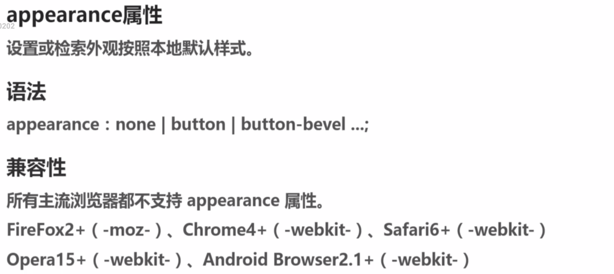
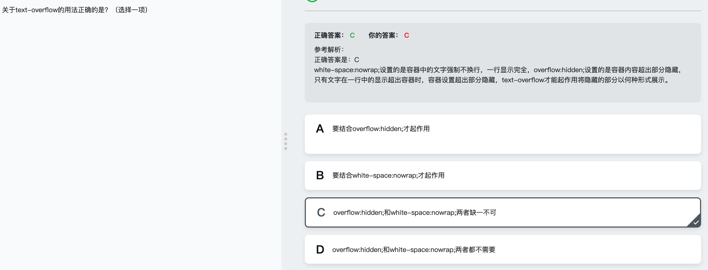
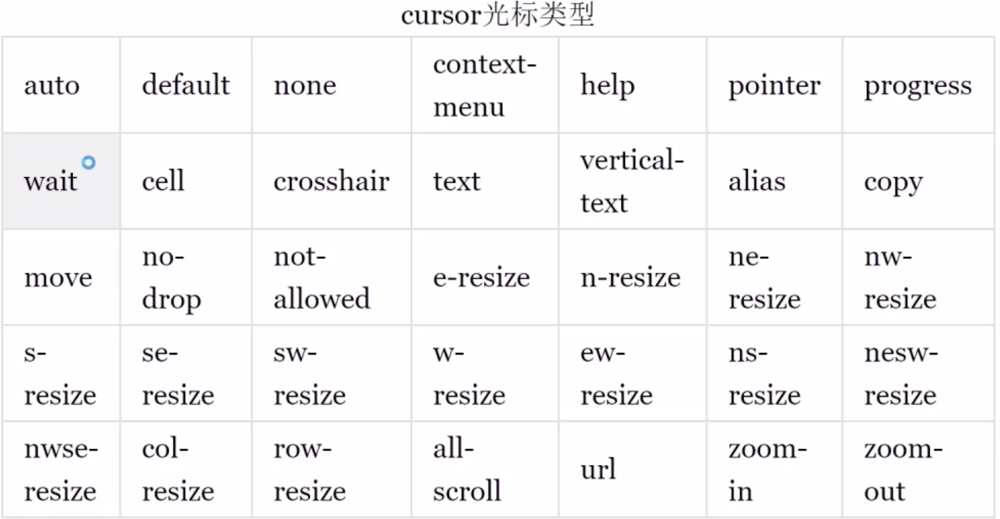

## CSS3多列

### columns

### column-width

### column-count

### column-gap

### column-rule

### column-span

### column-fill

### column-break

## CSS3用户界面

### appearance
- appearance:none|button|button-bevel ...;

主流浏览器都不支持该属性

</img>

### text-overflow
- text-overflow: clip | ellipsis

</img>

### outline
- outline是一个符合属性

> outline-width:<length>|thin|medium|thick
>
> <length> 可以写 px thick thin medium
>
>outline-color: <color>|invert
>
> invert 使用背景色的反色
>
> outline-style: none | dotted | dashed | solid | double
>
> outline-offset: <length>
>

### nav-index
不怎么用了

### cursor
</img>

### zoom
- zoom: normal | <number> | <percentage>  设置对象的缩放比例,不允许使用负值

### box-sizing
- box-sizin: content-box | border-box

### resize
> resize: none | both | horizontal | vertical
>
> none:不允许用户调整元素大小 both:用户可以调整宽度和高度
>
> horizontal: 用户可以调节元素的宽度 vertical: 用户可以调节元素的高度

### ime-mode

### user-select

### pointer-events
