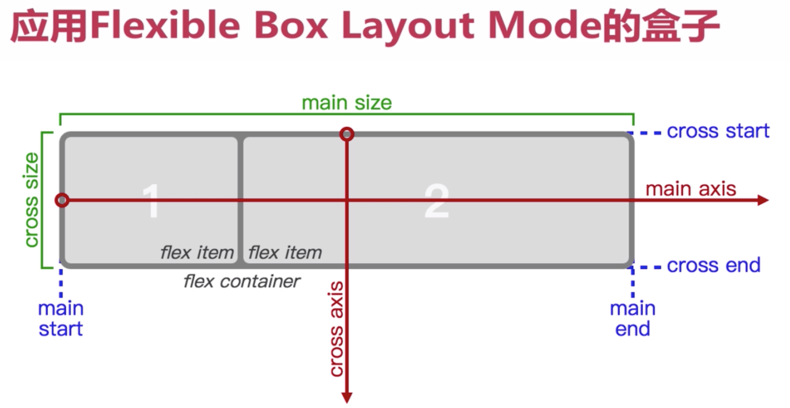
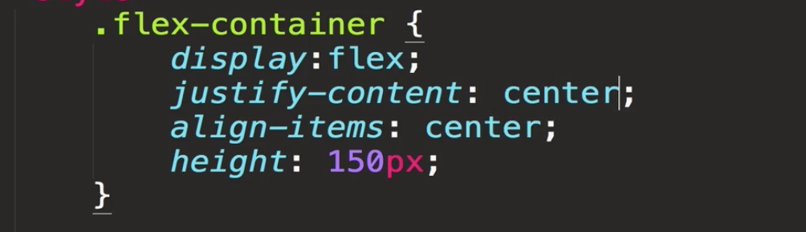
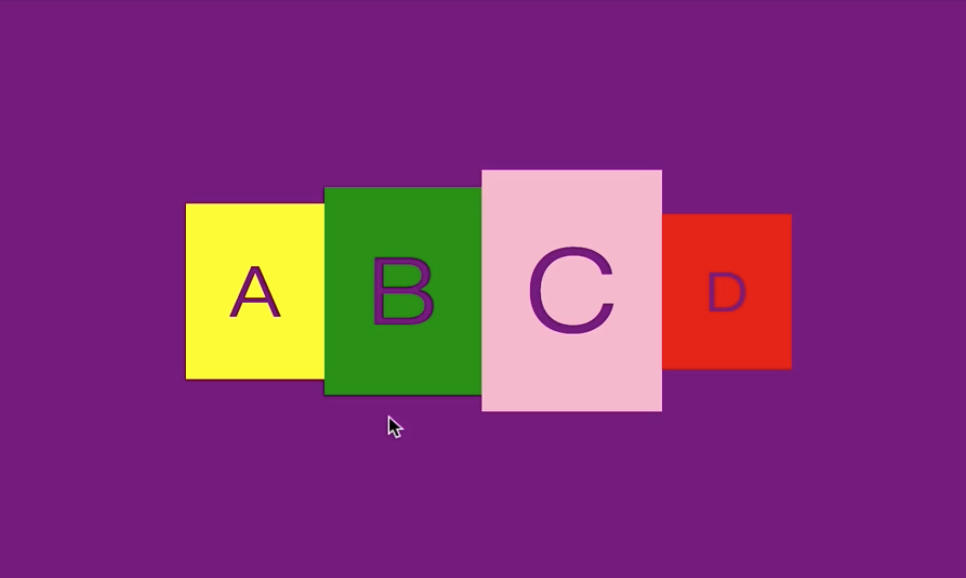
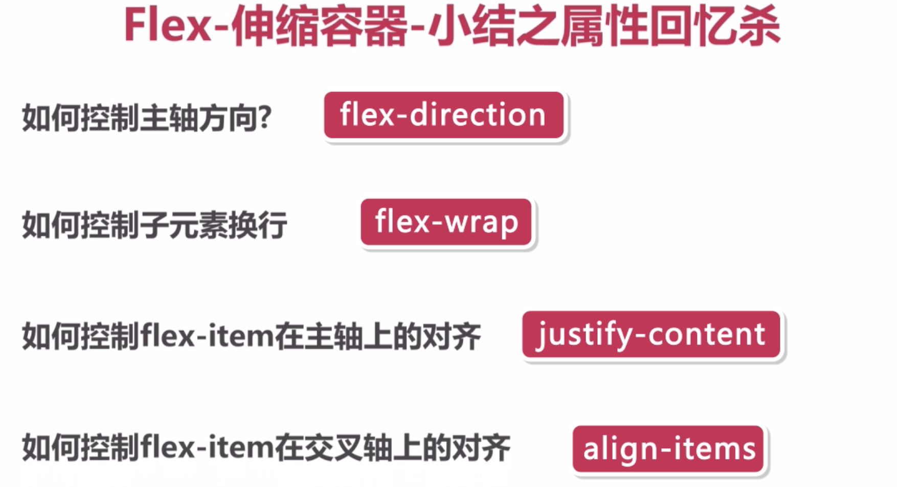
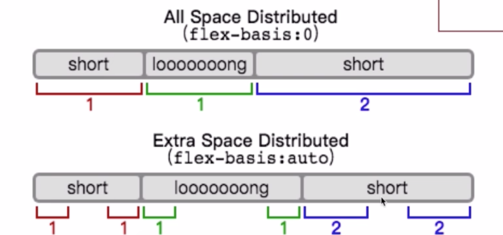
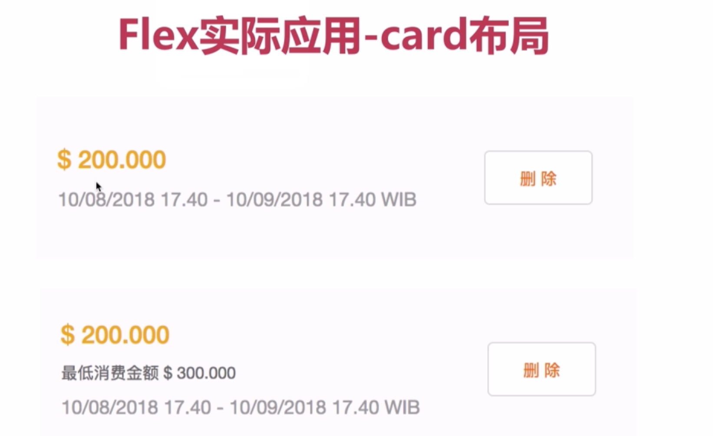

## flex弹性布局

- Flex = Flex(ible) Layout Box Model 弹性盒式模型


Layout Model||
--|
block-layout |
inline-layout|
table-layout|
positioned-layout|
flexible-box-layout| 重点
grid-layout|



### 伸缩盒子介绍
- 如何将盒子变得有弹性  -> display:flex/ display:-webkit-flex

## 伸缩容器属性的介绍

### display属性
- display : flex  容器内元素弹性伸缩
- display : inline-flex  父容器弹性伸缩
- display : -webkit-flex 涉及跨平台/浏览器时添加

### flex-direction属性

- flex-direction row | row-reverse | column | column-reverse

- flex-direction : row 表示主轴与内轴方向作为默认的书写模式，即横向从左到右排列（左对齐），display: flex是将对象作为弹性伸缩盒显示，即使子元素的宽度总和大于父元素的宽度，也会进行伸缩在一行显示。

### flex-wrap属性
- flex-wrap: nowrap不换行 | wrap | wrap-reverse

### flex-flow属性
- flex-flow是flex-direction和flex-wrap的复合属性

### justify-content属性
- justify-content: space-start | space-end | space-between | space-around

### align-content属性
#### align-content 控制容器内多行在交叉轴上的排列方式
- flex-start
- flex-end
- center
- stretch
- space-between
- space-around

```
  align-content 属性在弹性容器内的各项没有占用交叉轴上所有可用的空间时对齐容器内的各项（垂直）
  stretch 默认值。项目被拉伸以适应容器。
  center  项目位于容器的中心
  flex-start   项目位于容器的开头
  flex-end    项目位于容器的结尾
  space-between     项目位于各行之间留有空白的容器内
  space-around 项目位于各行之前、之间、之后都留有空白的容器内
```

### align-items属性
- 子元素在交叉轴上的对其模式
- flex-start
- flex-end
- baseline 以内容的底线对齐
- stretch


效果:


### 伸缩容器的属性总结


## 伸缩项目属性的介绍
### order属性
- order: 负数~正数 排列的次序

### flex-grow属性
- flex-grow: 数值越大,占地越大
数值相同,占地一样 默认值是0 没有任何效果

### flex-shrink属性
- 伸缩宽容度 1~∞(不能为负数) 当不想被收缩时,设置为0

### flex-basis属性
- flex-basis auto | [width]px | 0 | [num]%


### flex属性简写
- 是复合元素 伸展 | 收缩 | 基准
> flex: [flex-grow]|[flex-shrink]|[flex-basis]
>
>flex: 1 0 auto  / none / 0 /
>

### align-self属性
>flex-start
>
>flex-end
>
>center
>
>baseline
>
>stretch

## 伸缩盒子布局的实现
- flex-card布局

