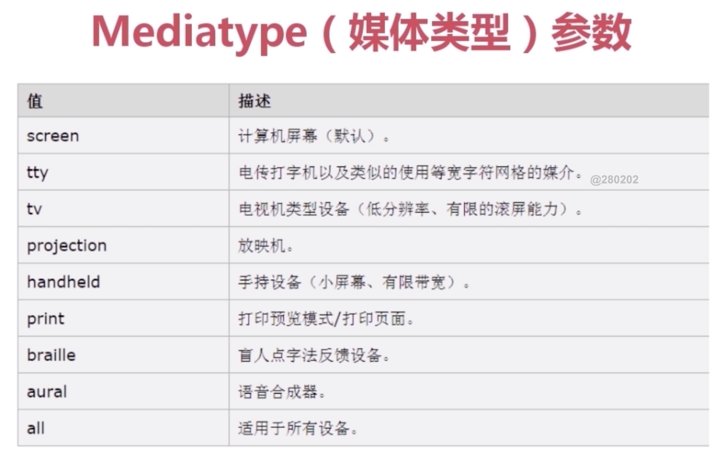
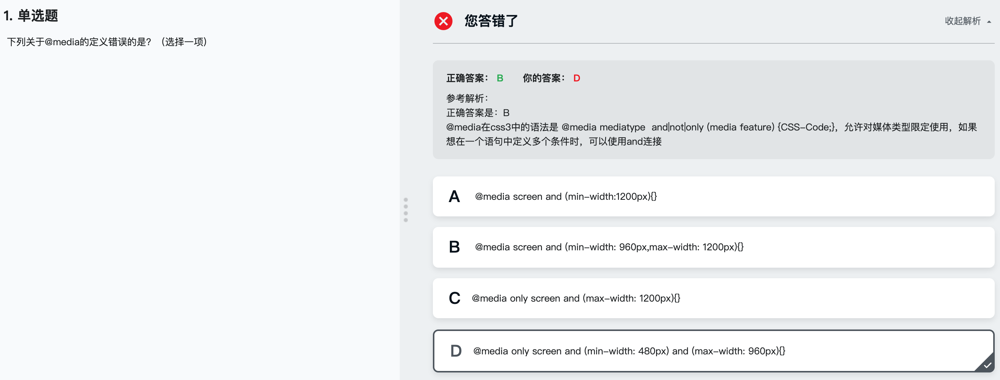

## 响应式布局
- 针对不同的屏幕尺寸设置不同的样式
- 面对不同分辨率设备灵活性

#### 响应式布局缺点
- 兼容各种设备 工作量大,效率低
- 代码累赘,会出现隐藏无用的元素,加载时间加长
- 一种这种方案,效果不佳

响应式布局的写法 写在样式中的
```
@media mediatype and(media feature){
  CSS-Code;
}
```
</img>
</img>

</img>

## 响应式的基本实现

- 小例子一

- 小例子二

## 响应式实战
