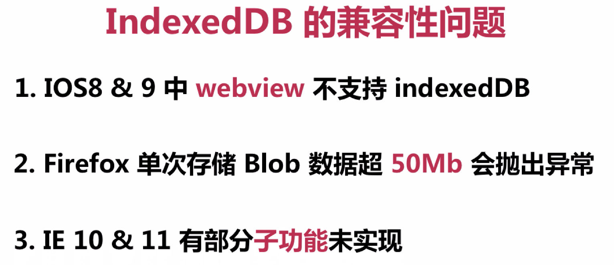

## HTML5本地存储
### localstorage
localstorage 和 sessionStorage
1.相同的使用方法
2.不同的存储时效
```
window.localStorage
localStorage.setItem("sieg","17");
localStorage.sieg=17;

//获取值
localStorage.getItem("sieg");

//删除值
removeItem();
localStorage.removeItem("sieg");
```
cookie 和 web storage的区别

cookie的大小受限,每次请求一个新的页面就会发送cookie,无形中浪费贷款,cookie的作用是与服务器进行交互,作为http规范的一部分存在,而web storage仅仅是为了在本地"存储"数据而生.
### API

clear()方法,清空所有数据
.length

不同的储存时效
localStorage没有储存时间

sessionStorage存储会在网页会话结束时失效

localStorage存储在 2-5MB 只能存储字符串
sessionStorage 存储容量不一 部分浏览器不设限

1.存储容量超出限制 抛出 QuotaExceededError异常,存储是应该使用try catch 避免异常未捕获

2.只能储存字符串

3.sessionStorage 失效机制
 - 刷新页面并不能使sessionStorage失效
 - 相同URL不同标签页不能共享 sess

### 存储实现打怪小案例


### 存储时效
实现一个带有过期机智的 localStorage

- 可以设置数据的存储时间
- 失效后清除数据
```
  new Date() //返回当前时间
  new Date().getMinutes() //返回分钟

  <input type="text" id="need"></input>
  <input type="text" id="timer"></input>
  <button id="btn">保存</button>
  <span></span>

  <script type="text/javascript">

    var nowTime = new Date().getMinutes();
    if(nowTime >= localStorage.timer){
      span.innerHTML = "暂无数据";
    }else{
      if(localStorage.leo){
        span.innerHTML = localStorage.leo ;
      }
    }

    btn.onclick = function(){
      localStorage.setItem("leo",need.value);
      localStorage.setItem("timer",new Date().getMinites()+Number(timer.value));
      span.innerHTML = localStorage.leo;
    }

  </script>
  ```


Web Storage 的优化
性能与存储容量大小无关,与读取次数有关

- 减少读取item次数
- 单个item中尽可能多的存储数据

## indexDB
- 如何创建数据库和表

```
1. indexedDB.open
var request = indexedDB.open(name,?version); 问号表示可有可无

request.onsuccess 数据库创建成功
request.onerror 数据库创建失败 (当版本号降低 低于之前的版本号 就会报错)
request.onupgradeneeded 版本号升级成功

2.indexedDB.createObjectStore 创建一个"表"
request.result.createObjectStore("table1"); 创建一个表
```

## 设置主键的两种方法

1.设置自增主键 - {autoIncrement:true}

```
  request.onupgradeneeded = funtion(){
    var db = request.result;
    db.createObjectStore('test1',{autoIncrement:true});
  }
  var db = request.result;  //拿到数据库
  var transaction = db.transaction('test1','readwrite'); //确定哪张表的读写
  var store = transaction.objectStore('test1');//操作哪张表
```

2.取数据中字段作为主键 - {keyPath:字段名}

```
var json = {
			'id' : 1001,
			'name':'Koi',
			'age':17
		}

request.onupgradeneeded = function(){
		console.log('版本升级成功!');
		var db = request.result;
		db.createObjectStore('test2',{keyPath:'id'});
	}
```
### 如何使用事务获取表

调用IDBDatabase.transaction 方法返回一个IDBTransaction对象,他含有一个objectStore方法,可以让用户通过制定模式操作数据库中的表
> indexedDB -> transaction -> objectStore

- 读写模式 readwrite
- 只读模式(默认) readonly

```
  setTimeout(function(){
    var db = request.result;
    var transaction = db.transaction('test1','readonly');
    var store = transaction.objectStore('test1');
    },300);
```

### 关于表的增删改查的相关方法

1.增加数据 IDBObjectStore.add()

2.获取数据 IDBObjectStore.get()


```
  var json = [{
    var id : 1,
    var name : 'blu',
    var age : '17'
    },{
    var id : 1,
    var name : 'Oxi',
    var age : '21'
    }];

  setTimeout(function(){
    var db = request.result;
    var transaction = db.transaction('test1','readonly');
    var store = transaction.objectStore('test1');
    store.add(json);
    var nodeResult = store.get(1);
    console.log(nodeResult.result);
    },300);
```

3.获取所有数据 IDBObjectStore.getAll()

```
  var json = [{
    var id : 1,
    var name : 'blu',
    var age : '17'
    },{
    var id : 1,
    var name : 'Oxi',
    var age : '21'
    }];

  setTimeout(function(){
    var db = request.result;
    var transaction = db.transaction('test1','readonly');
    var store = transaction.objectStore('test1');
    store.add(json);

    var nodeResults = store.getAll();
    for(var i=0;i<nodeResults.length;i++){
      console.log("id是"+nodeResults.result[i].id + "姓名是"+nodeResults[i].name + "年龄是"+ nodeResults.result[i].age);
    }
    },300);
```

4.继续添加数据 put

5.删除数据 delete(key值)

6.删除所有数据 clear

### IDBRequst 对象

1.使用IDBReuquest.onsuccess执行查询完成回调 onerror 指令失败了执行的回调函数

2.使用IDBRequst.result可以看到相关的数据

### indexDB-索引

store.createIndex(表名称,数据key值,{unique:true|false});(唯一性)

```
request.onupgradeneeded = function(){
        console.log('版本升级成功!');
        var db = request.result;
        var store = db.createObjectStore('test2',{keyPath:'id'});
        store.createIndex('test3','name',{unique:true}); //true就是唯一性 false就是可以不唯一
    }

//找到索引的内容

var index = store.index(表名称);
index.get(key值).onsuccess = function(e){
  console.log(e.target.result);
}
```
indexDB 支持多类型数据存储,相较web storage 存储空间更大,存储方式为键值对.

### indexDB-游标

- 如何创建游标
IDBObjectStore/IDBIndex.openCursor

- range: 指定游标范围

- direction:游标的方向

```
  var db = request.result;
  var transaction = db.transaction('test1','readwrite');
  var store = transaction.objectStore('test1');
  var requestNode = store.openCursor(IDBKeyRange.upperBound(202));
  requestNode.onsuccess = function(){
    var cursor = requestNode.result;
    if(cursor){
      console.log(cursor.value);
      cursor.continue();
    }
  };
  store.add(json);
```

IDBRage对象


bound(大于的参数,小于的参数,true|false,true|false);

- direction


```
  var request = store.openCursor(IDBKeyRange.bound(200,202),'prev');
```
1.可以查询指定数据集范围  2.拥有逆序遍历能力

## 游标索引结合与区别
### indexDB-游标索引结合



### indexDB-区别

- localStorage 和 sessionStorage
localStorage 关闭再打开,数据任然存在

sessionStorage 关闭数据就没有了,刷新数据仍在
