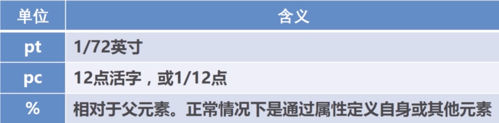

# SVG 介绍
- SVG 可缩放矢量图形 Scalable Vector Graphics
- SVG 用来定义用于网格的基于矢量的图形
- SVG 使用XML格式定义图片
- SVG是万维网的标准
#### SVG的优势
- SVG可被非常多工具读取和修改(比如记事本)
- SVG图像中的文本是可选的,同时也是可以被搜索引擎读取到(很适合制作地图)
- SVG 与 JPEG和 GIF图像相比,尺寸更小,且压缩性更强
- SVG文件是纯粹的XML


## SVG视口
### viewport
```
<svg width="800" height="600"></svg>
默认单位是像素 所以不写px
```



SVG, <rect> 等默认单位是像素.

### viewBox

SVG就像是我们的显示器屏幕, viewBox就是截屏工具选项中的那个框框,最终就是把框框中的截屏内容再次全屏显示.

语法: viewBox="x,y,width,height"

### preserveAspectRatio
```
  perserveAspectRatio[defer]<align><meetOrSlice>
  defer参数是可选值,它仅仅在image元素上应用preserveAspectRatio属性时才使用.在使用其他元素时会被忽略.
```


meetOrSlice参数
控制viewBox缩放的方式


---

## 坐标系统
### 世界坐标系统
### 最初坐标系统
### 用户坐标系统
### 转换坐标系统
### 转换坐标系统-rotate
### CSS3与SVG2

---

## SVG形状
### svg绘画各种形状
### 直线命令
### 曲线命令
### 弧形
