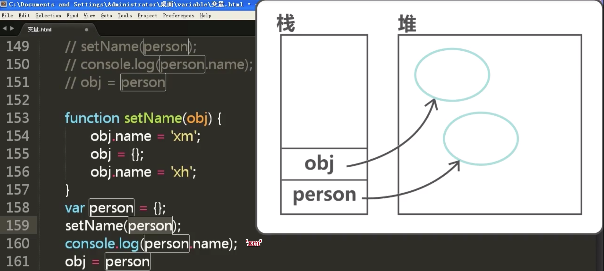
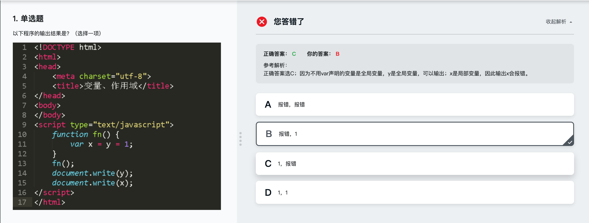
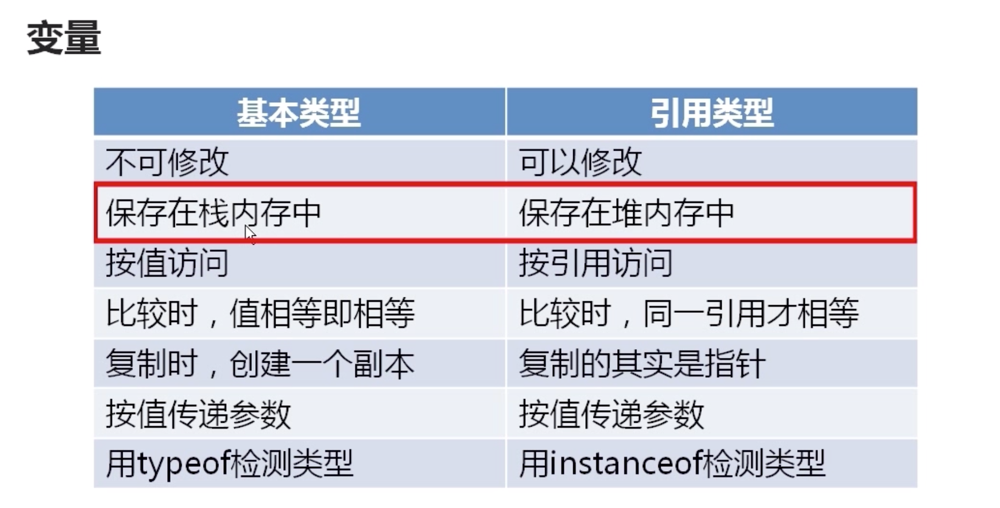

## JS知识点回顾
变量的命名

>$ _ 字母开头
>
>在jQuery中 $ == jQuery
>
>区分大小写 num NUM

## 变量
### 数据类型和堆栈
基本类型
4 'str' true/false undefined null

引用类型
> var person{}
>
>person.name = 'Bill'
>
>delete person.name
>
>person.family = ['father','mother'']

* 但是基本类型是无法添加属性的

* 函数是引用类型,可以给函数添加属性和方法

```
  function fn(){

  }
  fn.per = 'xm';
  console.log(fn.per);   // 'xm'
```

### 变量比较和值的复制
```
[]==[] false
[]===[] flase
4==[4] true
4===[4] false
```

typeof null -> Null

null instanceof Object -> false  //instanceof 不能用于基本类型结构都是false


### 参数传递和类型检测
</img>

## 作用域与解析机制

- 全局作用域
- 局部作用域:函数作用域



### 全局作用域和局部作用域
### 变量对象和作用域链
### JS解析机制-预解析
### JS解析机制详解

- 作用域链


局部变量优先于外层变量


```
var name = "xm";
funciton fn(){
  var name = "xh";
  console.log(name);  // xh
}

---------------------
var name = "xm";
funciton fn(){
  console.log(name);
  var name = "xh";  // undefined
}

```
* 不建议在代码块里定义函数,部分老版本的浏览器不支持

```
document.write(fn); // 预解析之后是 function fn(){}
function fn(){}
```
- js预解析只解析带var的变量

## 内存管理与垃圾收集机制
### 垃圾收集机制
JS可以自动回收垃圾
原理:找出没用数据,打上标记,释放内存;周期性执行

```
表示无用数据策略
  - 引用计数

```


### 管理内存

- 解除引用主要适用于大部分的全局变量
- 局部变量不需要关心

```
var arr = [...] //很大的数据
...
arr = null; //当全局变量后续不用时,删除引用
```
## 课程总结



作用域链,从里向外查找,查找不到就报错.

JS解析机制, 预解析 先解析var,再解析funciton

垃圾回收机制
标记清除是目前主流的垃圾算法--给不用的值加标记

引用计数的算法会因为循环引用而得不到释放--当变量不用时,手动解除引用
