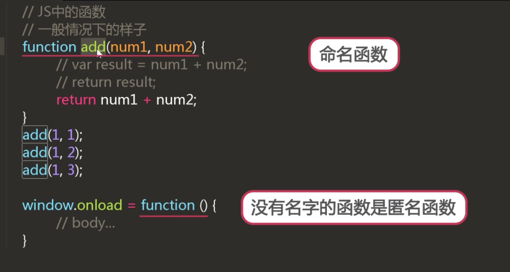

## 对象
### 对象创建
- 直接赋值
var cat = {
  'name':'Tom';
  'age':4;
};

- new一个对象
var cat = new Object();

### 对象属性赋值
cat.name = 'Jacob';
cat['name'] = 'Tim';

console.log(cat.name);

>delete 删除某一属性
>
>delete cat.name
>
>in 判断某一属性是否属于某个对象
>
>console.log('name' in cat); //属性名 in 对象
>

### for in
for(var p in cat){
  console.log(p);
  console.log(cat[p]); //两者一致
}


## 函数的介绍

- js中的函数
```
  一般情况下的函数
  function add(num1,num2){
    return num1 + num2;
  }
```

可以复用代码
var add = function(){
  return 1;
}

console.log(add());
console.log(add); //结果为函数本体



- js函数的括号

setTimeout(fn,1000); //将函数穿进去
setTimeout(fn(),1000); //执行函数fn

function fn(){
  console.log(1);
}

```
function fn(){
  return function(){
    console.log(1);
  }
}

fn(); //返回一个新的函数
fn()(); //执行返回的新函数

```

## 函数的定义

- 函数的三种定义方式


```
字面量
  |--function声明 不需要分号
    function add(){
      //body...
    }
  |--var赋值表达式 需要分号
    var add = function(){
      //body...
    };
add();
构造函数
  |--效率低 还很麻烦
  var add = new Function('num1','num2','return num1 + num2');

```
前两个是声明,而后两个是赋值表达式.

- JS中没有块级作用域,只有作用域才可以预解析


```
  if(true){
    function fnx(){...}
  } else{
    function funy(){...}
  }
//这种定义是错误的

if(true){
    var fnx = function(){...};
} else{
    var funy = function(){...};
}
//这种定义就是可以的,预解析先解析var fnx和funy是undefined

//对象中的函数
var person= {
  name :'Tim';
  setSex:function(sex){
    this.sex = sex;
  }
};
person.setName = function(name){
  this.name = name;
}

person.setSex();
```

4-11 编程练习
小伙伴了，写出一个加法(add)函数，并在其内部定义一个函数(isNumber)，用来判断add的参数是否可以转化为数字类型进行相加，

如果可以，就在页面中输出结果；

如果不能就退出add，给出提示“请传入数字类型的参数”。


任务

1.     定义加法(add)函数

2.     在其内部定义一个函数(isNumber)内部函数可以访问外部函数的变量。

3.     函数(isNumber)内，使用isNaN来判断数据是否可以转换为数字类型，返回true表示不行，返回false表示可以

4 .    将结果输出
```
function add(num1,num2){
    if(!isNaN(num1) && !isNaN(num2)){
        return Number(num1)+Number(num2);
    }else{
        document.write('请传入数字类型的参数');
    }
}

var res = add(parseInt('1'),parseInt('2'));
document.write(res);
```
