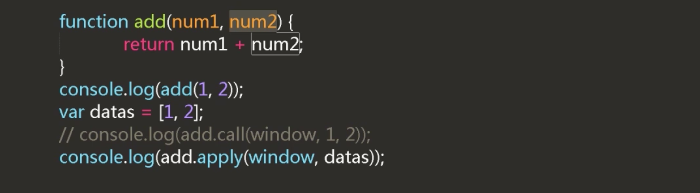

## 函数的调用
### 1 普通函数的调用
```
var add = function(x,y){
  return x + y;
}

add(1,2);
```

- 匿名函数的执行

```
  function(){
    console.log(1);
  }

//匿名韩式执行方式1
  (function(){
    console.log(1);
  })();

//匿名韩式执行方式2
  (function(){
    console.log(1);
  }());
```

```
//匿名函数调用
!function(num1,num2){
  var res = num1 - num2;
  document.write(res);
}(56,23);

```

- 递归调用

```
5! = 5*4*3*2*1;
5! = 5 * 4!;

function factorial(num){
  if(num <= 1)return 1;
  return num * factorial(num - 1);
}
```

### 2 方法的调用

document.click = function(){
  console.log('你点击了文档!');
}
document.onclick(); //<-- 相当于模拟点击,打开页面自动点击


```
<!DOCTYPE html>
<html lang="zh-CN">
<head>
<meta charset="UTF-8" />
<title>方法的调用</title>
<style type="text/css">
    #box{position: relative; width: 100px; height: 100px;
         background-color: red; margin: 10px auto;}
    #close{position: absolute; right: 0px; top: -4px; color: yellow;}
    #btn{display: block; width: 100px; margin: 0 auto;}
</style>
</head>
<body>
    <div id="box">
        <span id="close">X</span>
    </div>
    <button id="btn">关闭</button>
<script type="text/javascript">
    // 在此处补充代码
    var close = document.getElementById('close');
    var box = document.getElementById('box');
    var btn = document.getElementById('btn');
    close.onclick = function(){
        box.style.display = 'none';
    }

    btn.onclick = function(){
        box.style.display = 'none';
    }

</script>
</body>
</html>

```

### 3 构造函数的调用

//普通函数
function add(){

}

//构造函数
function Person(){

}
var num = add();
var obj= new Person();
构造函数只有通过new, 才能生成对象.


call,apply的使用方法(可以改变this的指向)


call只能一个参数一个参数的传值,apply可以传入对象




### 4 函数的简介调用

## 参数的使用

短路运算


```
  power = power || 2;
  //当power没有值的话,程序走到2发现2有值,则将2赋值给power
  //当power有值得话,程序走到power并将power的值赋值给前面的power
```

js中隐藏的可变参数arguments


结果是 undefined  和 15

- 计算最小值,使用可变参数&函数的apply方法

```
//在此处补充代码
function getMin(){
    if(arguments.length == 0)return;
    var min = arguments[0];
    for(var i = 0;i<arguments.length;i++){
       if(min>=arguments[i+1]){
           min = arguments[i+1];
       }
    }
    return min;
}
var arg = [2, 4, 1, -1, 56, 3, -7];
var res = getMin.apply(window,arg);
document.write(res);
```

### arguments类数组

arguments指代的就是形参
```
  function fn(name){
    arguments[0]= '';
    console.log(name);  //结果为空字符串
  }

```

- arguments.callee  指代函数本体

```
function add(num1,num2){
  alert(arguments.callee);
  return num1 + num2;
}

alert打印出的结果是 函数的本体
```

- arguments.callee 常用于内部使用,即使函数名修改也不会有影响

```
function factorial(num1){
  if(num1<=1) return 1;
  return num1 * arguments.callee(num1-1);
}
//如果我把factorial改了别的名字也不影响
```

- 判断形参和实参的长度是否一致

```
function add(num1, num2){
  if(argumets.length != add.length) throw new Error('请传入'+add.length+'个参数!');
  return num1 + num2;
}
```

小练习,

```
<!DOCTYPE html>
<html lang="zh-CN">
<head>
    <meta charset="UTF-8" />
    <title> arguments</title>
</head>
<body>
   <p id="test" style="background-color: red; color: blue;">我是一个段落！</p>
<script type="text/javascript">
// 在此处补充代码
function css(ele,prop,value){
    if(arguments.length == 3){
        var tom = document.getElementById(ele);
        tom.style[prop] = value;
    }

    if(arguments.length == 2){
        var tom = document.getElementById(ele);
        return tom.style[prop];
    }
}

var res = css('test','color');
var res2 = css('test','background-color','yellow');

document.write(res);
</script>
</body>
</html>

```
当形参过多的时候,可以传入对象,不用考虑形参的顺序


- 函数也可以作为参数

```
setTimeout(function(){
  //body...
  },1000);
```


