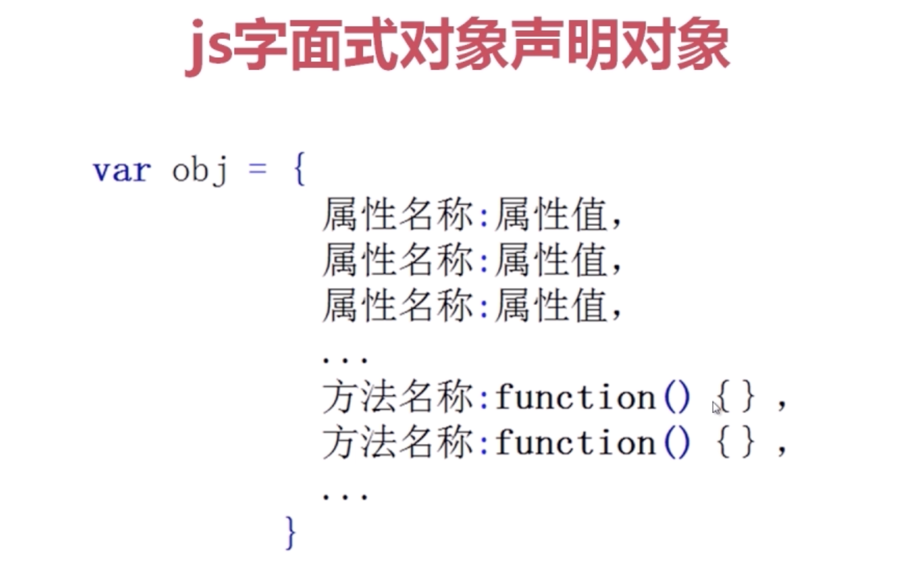

- 面向对象

对代码的一种抽象,对外统一提供调用接口的编程思想.
js的基于原型的对象方式中,对象object则是依靠构造器(constructor)利用原型(prototype)构造出来的

属性,方法,对象,原型

原型 js中由prototype属性引用了一个对象,即原型对象(所有的函数都有一个prototype属性,该属性引用了一个对象,即原型对象)

```
function F(){}
F.prototype instanceof Object; // 为true;

```

- 函数构造器构造函数(效率低,var1,var2的顺序也不能改变)

```
结构 var obj = new Function(var1,var2,...,FucntionBody());

var obj = new Function('a','b','return a+b');
var s = obj(1,2);
alert(s); // 3

```

- 闭包

```
var n = 999;
function F(){
  alert(n);
}

F(); // 999

----------
function F(){
  var n = 999;
}

F();
alert(n);  //报错,没有定义

```

- 闭包有利于封装,可以访问局部变量

- 内存占用浪费严重,内存泄漏




```
var count = function(){
  var num = 0;
  return function(){
    var result = num++;
    alert(result);
  }
}
var numResult = count();
numResult();
numResult();
numResult();

```


#### 对象可以当做数组进行遍历

```
var obj = new Object();
obj.name = 'aaa';
obj.price = 'bbb';
obj.action = function(){
  alert('ccc');
}

for(var i in obj){
  alert(i);
}
for(var i in obj){
  alert(obj[i]);
}
```


