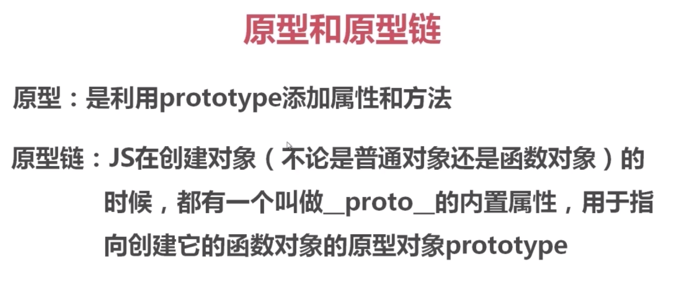
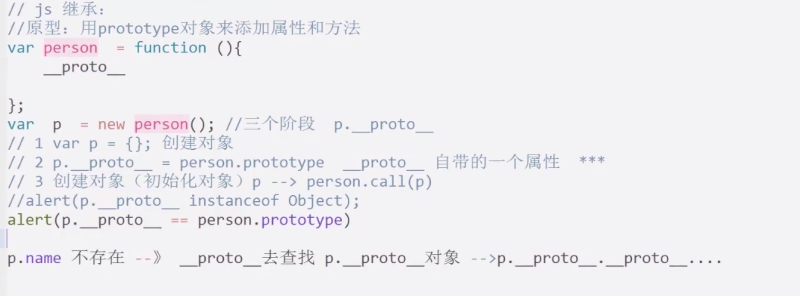
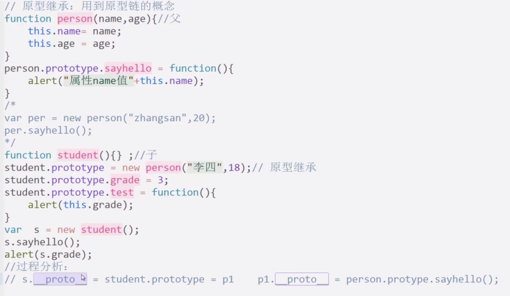
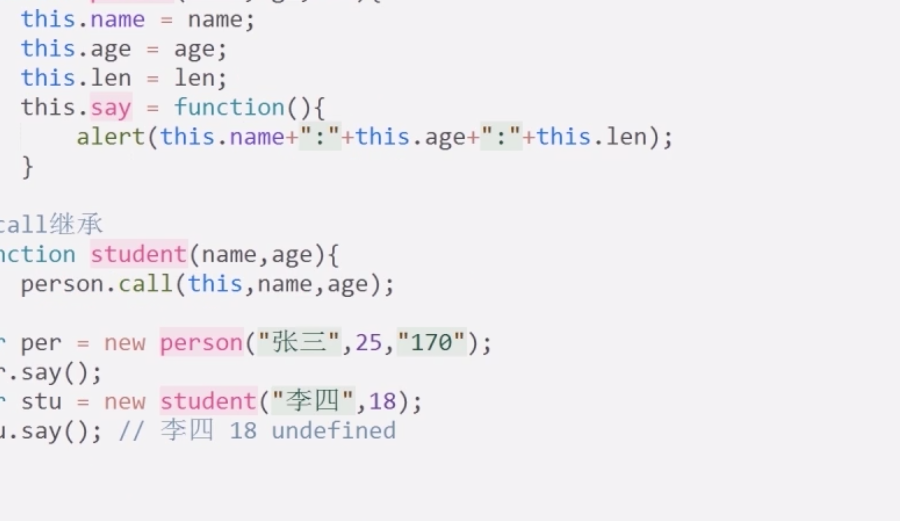
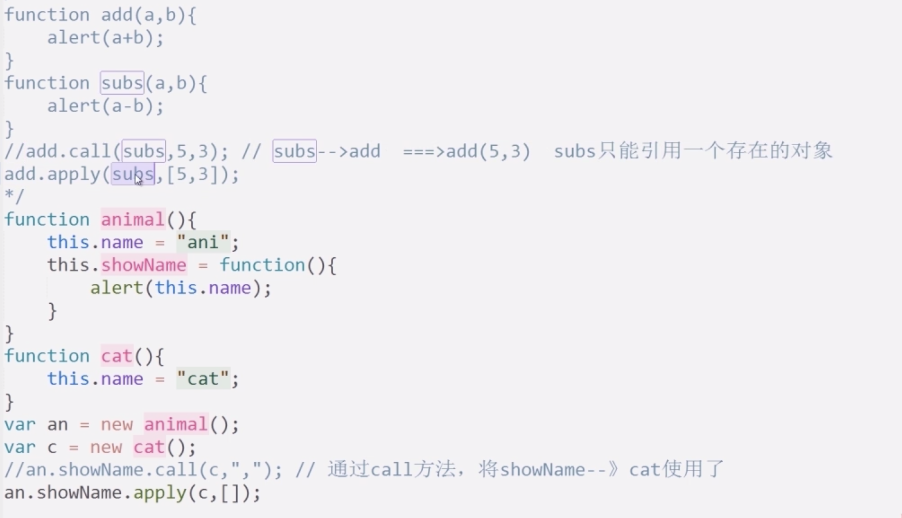
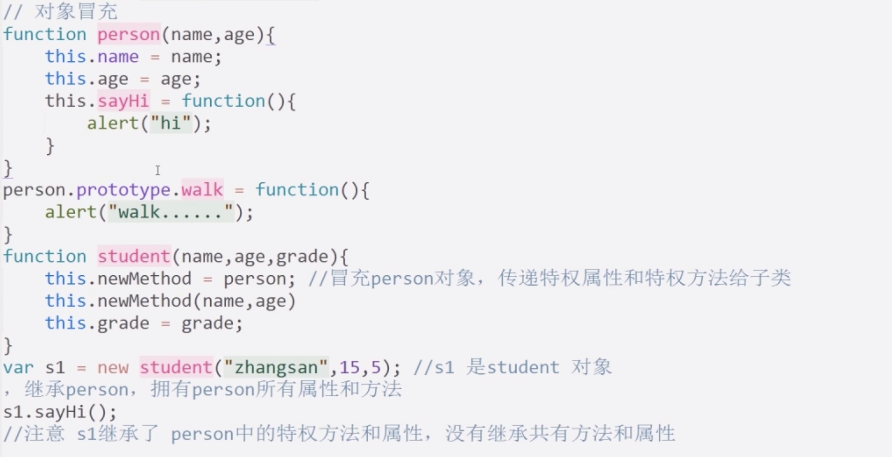

## javascript的封装

- 缺点: 占用内存,不利于继承

```
<script type="text/javascript">
  function test(){
    var _xx = function(){
      console.log(11111);
    }
    function _test(){
      _xx();
    }
    return _test;
  }

  var ty = new test();
  ty();

</script>
```

```
function student(){
    var privateStore = {};
    function _set(name,sex,age){
        privateStore.name = name;
        privateStore.sex = sex;
        privateStore.age = age;
    }
    function _get(){
        return privateStore.name + '--' + privateStore.sex + '--' + privateStore.age;
    }
    this.get = function(){
        return _get;
    }

    this.set = function(){
        return _set;
    }
}

var o = new student();
o.set()('xiaom','maile',23);
alert(o.get()());
```



#### 原型链


#### 原型继承



原型值的最终对象可以是null

任务

1. 使用构造方法创建一个对象Animal , 并为其添加属性名称和数量。

2. 创建一个动物对象Cat并使用原型的方式继承对象Animal。

3. 使用原型的方式为Cat定义一个方法 info ,方法中弹出动物名称和数量。

4. 实例化Cat并调用方法info。

```
function Animal(name,num){
    this.name = name;
    this.num = num;
}

function Cat(){};
    Cat.prototype = new Animal('xm',1);
    Cat.prototype.info = function(){
        return alert(Cat.prototype.name + '--' + Cat.prototype.num);
    }

var black = new Cat();
black.info();

```

- call 与 apply 的方法调用

```
  obj.call(function(),var1,var2,var3);
  obj.apply(function(),[var1,var2,var3]);
```


继承的时候允许多传参数,多的部分会被截掉.

```
function Animal(name,age){
    this.name = name;
    this.age = age;
    this.getInfo = function(){
        alert(this.name +'---'+this.age);
    }
}

function Cat(name,age){
    Animal.call(this,name,age);
}
function Dog(name,age){
    Animal.apply(this,[name,age]);
}
var c = new Cat('xh',2);
c.getInfo();
var d = new Dog('vv',4);
d.getInfo();

```

### JS的关键字
delete xxxx; //OK
delete xxx(); //NG 无法删除对象的属性
obj instanceof Test; //true false



callee 返回正在执行的function对象,function内容,就是指代函数本身
arguments 实参的集合


