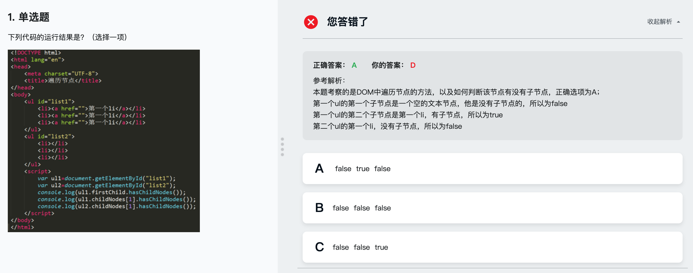

## 创建节点
---
####  create系列方法

```
document.createElement();
document.createTextNode();
document.createDocumentFragment(); 文档片段
document.createComment(); 注释文本
```
- document.body.insertBefore(comment,document.body.firstChild);
insertBefore(内容,具体元素的位置);  //在某元素前插入元素

* 匿名函数不污染window环境

- IE浏览器中可使用/*@cc_on ...  @*/ ...是只有被IE浏览器执行的语句,
且该语句其他浏览器已注释方式读取,不编译

```
(function(){
  if(/*@cc_on !  @*/)return;
  var e = 'abbr, article, aside'.split(', ');
  var i = e.length;
  while(i--){
    document.createElement(e[i]);
  }
  })();
```

插入节点,我原先写错了,最后没有写document.body.appendChild(e);这个
```
<script>
  //在此处补充代码
(function(){
  var e = document.createElement('ul');
  var frag = document.createDocumentFragment();
  for(var i = 1; i<=3; i++){
      var dot = document.createElement('li');
      dot.className = 'li';
      var txt = document.createTextNode('第'+i+'个li');
      dot.appendChild(txt);
      frag.appendChild(dot);
  }
  e.appendChild(frag);
  document.body.appendChild(e);
})();
</script>

```

#### 高效创建节点的方法
```
  innerHTML
  outerHTML
  innerText
  outerText

```

```
<div id='content'></div>
var content = document.getElementById('content');
var str = '<p>xxxxxx</p>
  <ul>
    <li>55</li>
  </ul>
';
content.innerHTML= str;  //<--高效
```


outerHTML返回调用它的所有子节点的HTML标签
```
innerText = '<p>xxxx</p>' // <-- <p>是不解析的
outerText 不建议使用,诸多浏览器不支持
```

## 节点遍历


---


---


```
  var dcm = document.documentElement;
  var oHead = dcm.childNodes.item(0);
  var oBody = oHtml.childNodes[1];

  //判断祖先节点
  console.log(oHead.ownerDocument == document);

  //判断含有子节点
  console.log(oBody.hasChildNodes());

```
### 错题理解



##### 答案


```
<!DOCTYPE html>
<html lang="en">
<head>
  <meta charset="UTF-8">
  <title>节点遍历</title>
</head>
<body>
  <div>
    <p>
      <span>
        <a href=""></a>
        <a href=""></a>
        <a href=""></a>
      </span>
      <span>
        <a href=""></a>
        <a href=""></a>
        <a href=""></a>
      </span>
      <span>
        <a href=""></a>
        <a href=""></a>
        <a href=""></a>
      </span>
    </p>
  </div>
    <script>
    // 此处补充代码
    (function(){
  var s = '';
  function travel(space, node){
    if(node.tagName){
      s += space + node.tagName + '<br/>';
    }
    var l = node.childNodes.length;
    for(var i = 0; i<l; i++){
      travel(space + "* ",node.childNodes[i]);
    }
  }
  travel("",document);
  document.write(s);
})();
    </script>
</body>
</html>

```

### 节点遍历（解决空白节点）
```
<script>
  (funciton(){
    var box = document.getElementById("box");
    for(var i = 0, len = box.childNodes.length; i < len; i++){
      //当nodeType为1的时候表明是元素节点
      fi(box.childNodes[i].nodeType == 1){
        console.log(box.childNodes[i]);
      }
    }
  })();
<script>
```


- children[x]<--不返回空白文本节点,返回元素节点.

- childElementCount<--返回直接子元素节点个数,不包含空白文本节点.

那么 上面的代码可以写成

IE8以下不支持
```
<script>
  (funciton(){
    var box = document.getElementById("box");
    for(var i = 0, len = box.childElementCount; i < len; i++){
        console.log(box.childNodes[i]);
    }
  })();
<script>
```

#### 类数组对象 NodeList

var box = document.getElementById("box");
var nodes = box.childNodes;
console.log(nodes[1]);

#### 类数组对象 HTMLCollection
- Ele.getElementsByTagName();
- document.scripts
- document.links
- document.images
- document.forms
- tr.cells <--返回所有td
- document.getElementById('select').options;
- document.getElementsByTagName('p');

```
  HTMLCollection[2]
  HTMLCollection[3]
    getLength:fucntion(){}
    namedItem:function(){}
```
var cells = tr.cells;

console.log(cells.namedItem('td'));

namedItem 优先寻找id为td的子元素,如果没有,找第一个name为td的子元素.


#### 类数组对象 NamedNodeMap
通过 ele.attributes 获得NamedNodeMap对象

```
<a id='box' data-url='index.html' node-action='submit'>

var box = document.getElementById('box');
var col = box.attributes;
console.log(col);
col[0];
col[1];
col[2];

//console
NamedNodeMap {0:id, 1:data-url, 2:node-action}
id
data-url
node-action
```

#### 类数组对象的动态性


var divs = document.getElementsByTagName('div');
可以动态反应divs的个数

---

## 获取节点


```
  getElementById方法必须在document后使用.
  getElementsByName也必须在document后使用.
```

解决getElementById的bug 主要是考虑兼容IE8以下,个人认为可以不用考虑.

- ele.getElementsByClassName();

```
  ele.getElementsByClassName('dark light')//类名颠倒也可
```

- querySelector()
返回一个元素
querySelector('#myUI')


- querySelectorAll() 两个方法
返回一组元素 StaticNodeList对象   (NodeList具有动态性)
querySelectorAll('.username');

## 操作节点


appendChild()在尾部插入子节点

insertBefore(var1,var2)在已知的子节点(var2)前插入新节点(var1)

##### replaceChild


```
<!DOCTYPE html>
<html lang="en">
<head>
  <meta charset="UTF-8">
  <title>节点练习</title>
</head>
<body>
    <div id="wrap">
      <ul id="list">
        <li>第一个li</li>
        <li>第二个li</li>
        <li>第三个li</li>
      </ul>
    </div>
    <script>
     //在此处补充代码
    var div = document.getElementById('wrap');
    var ul = div.querySelector('#list');
    var ulNew = document.createElement('ul');

    var list = ['HTML','CSS','HTML5','CSS3'];
    // document.write(list);

    for(var i =0; i<list.length; i++){
        var txt = document.createTextNode(list[i]);
        var li = document.createElement('li');
        li.appendChild(txt);
        ulNew.appendChild(li);
    }

    document.write(ulNew);

    div.replaceChild(ulNew,ul);

    </script>
</body>
</html>
```


clone(); //只克隆当前节点
clone(); //深度克隆,包括子节点

```
var ul = document.selectElementById('myUI');
var ul1 = ul.clone();
var ul2 = ul.clone(true);

```

#### normalize


```
//控制台
2
1
DOM探索之节点操作篇
```


问题


## 删除节点

var list = document.getElementById('#list');

list.removeChild(list.childNotes[1]);
