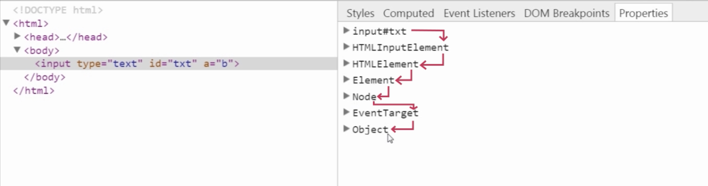
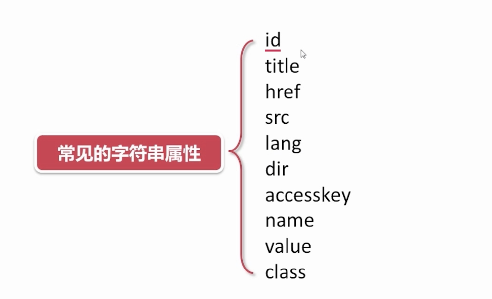
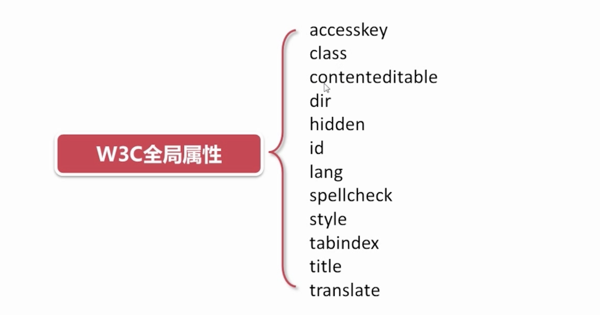

# 属性的分类
>布尔属性
>
>字符串属性
>
>data属性
>
>class属性

### 固有属性(Property)

- 浏览器事先绑定好的属性,叫做固有属性.

- 没有的,自己添加的叫做自定义属性

```
<div url='https://www.xxx.com'>
</div>

//url为自定义属性

```

#### 👇例如一个input 对其下面的元素都是继承关系



### 自定义属性(Attribute)

```
<div url='www.xxx.com' xxx='aaa' Yyy='bbb' xxx='ccc'></div>

<script>
  var div = document.querySelector('div');
  console.log(div.attributes);
</script>

--------console--------
1) xxx='ccc' <---重复  会被解析时候干掉
2) Yyy='bbb' <---被转化为小写 yyy
3) NamedNodeMap{0:url,1:xxx,2:yyy}

```

### attributes

- 通过元素的nodeName属性可以获得标签的名字

```
  console.log(div.nodeName); //返回标签名称(大写)
```

- 获取自定义属性的值

```
  console.log(div.attributes.getNamedItem('xxx').nodeValue);
  // aaa

  console.log(div.attributes.getNamedItem('nodeName').nodeValue);
  //报错 undifined .... <--标签里没有nodeName属性,获取不到,只可以获取显式定义的属性

  console.log(div.attributes['xxx'].nodeValue);
  该式子与上面第一个式子是等价的.

  //删除属性
  div.attributes.removeNamedItem('yyy');

  //创建属性
  var attr = document.createAttribute('data-title');
  attr.value = 'ddd';
  div.attributes.setNamedItem(attr);

```
## 对固有属性和自定义属性的通用操作方法

### getAttribute

```
  console.log(div.getAttribute('url'));
  console.log(div.getAttribute('onclick'));
  console.log(div.onclick);

  //编写js代码时,多使用div.onclick
```

### setAttribute

```
  div.setAttribute('xxx','a');
  div.setAttribute('style','color:blue');
  div.setAttribute('onclick','alert(1)');
```

### removeAttribute

```
  div.removeAttribute('style');
```

# 其他属性
### 布尔属性

```
  <input type='checkbox'>北京
  <input type='checkbox' checked='checked'>香港
  <input type='checkbox' checked>上海

  <script>
    var in = document.querySelectorAll('input');
    in[0].checked = true;
    //checked是input的固有属性 removeAttribute无法使用
  </script>
```
- readOnly属性的o大写是特例

```
  <input id='IDer' readonly='readonly'>

  <script>
    var ider = document.querySelector('#IDer');
    ider.readOnly = 'false'  //设置之后,又可以编辑input了
  </script>

```

- disabled

表单提交,但是后台不会接受disabled标注的值
用js将disabled设置为true

- multiple 多选

```
<select multiple='multiple'>
  <option>one</option>
  <option>two</option>
  <option>thre</option>
</select>
```

- hidden

不显示元素

### 字符串属性



### W3C定义全局属性


- title属性 当鼠标悬停,可以显示内容信息

- accesskey 快捷键激活相应元素

```
  <input type='text' name='txt1' accesskey='a'/>
  <input type='text' name='txt1' accesskey='s'/>

  //通过alt + a 可以迅速激活
```

### data属性

- 以data开头的属性,都会自动存储在一个叫dataset的元素属性里,用于查找

```
  <button id='btn' data-xxx-yyy='aaa'  data-toggle='bbb'></button>

  <script>
    var btn = document.selectElementById('btn');
    console.log(btn.dataset.xxxYyy);  //如果是连字符链接,使用驼峰
    console.log(btn.dataset.toggle);
  </script>

```

### 自定义class操作方法
