# 认识JS事件
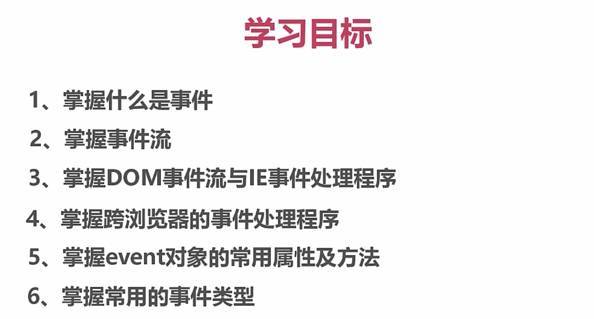

#### 什么是事件?

与页面交互的动作,被js侦测到的行为,解析器会创建相应的event

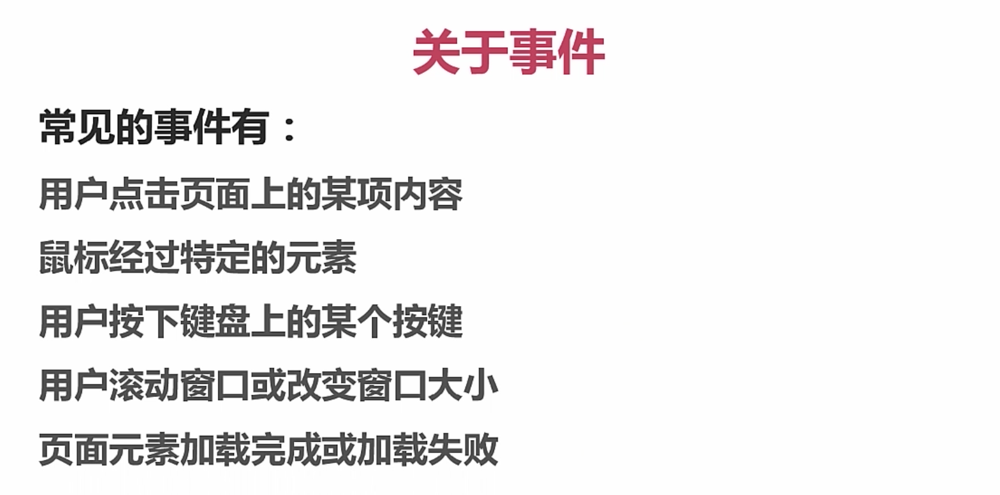

#### 事件句柄

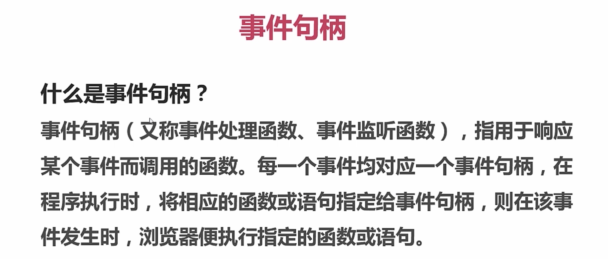

```
  <button id='btn'>点击我</button>
  <script>
    var btn = document.getElementById('btn');
    //为button添加事件句柄
    btn.addEventListener('click',function(){
        alert(1);
    });
  </script>
```

# JS事件详解

### 事件定义

>绑定事件三要素
>
>事件对象 , 事件类型 , 事件句柄

#### HTML中定义事件(强耦合,不利于复用代码)

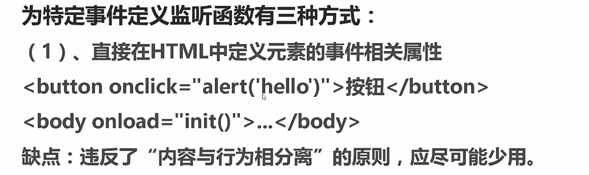

#### DOM0级事件(缺点,只能绑定一个事件)
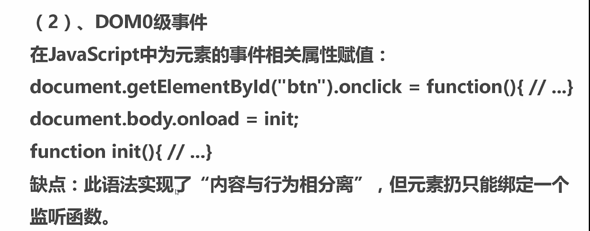

```
<button id='btn'>点击我</button>
<script>
  var btn = document.getElementById('btn');
  var dom0 = funciton(){
    alert('DOM0级事件绑定方式');
  }

  var dom00 = function(){
    alert('DOM0级事件绑定2号)');
  }
  //为button添加事件句柄
  btn.onclick = dom0;
  btn.onclick = dom00; //会将前一个绑定方式给覆盖掉
</script>
```

#### DOM2级事件(可以绑定多个事件,事件捕获,事件冒泡)

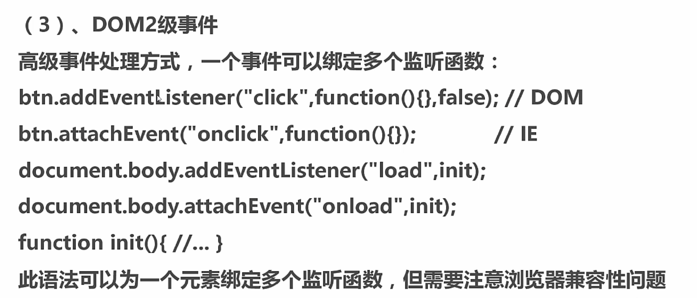

```
<button id='btn'>点击我</button>
<script>
  var btn = document.getElementById('btn');

  //addEventListener的参数(事件类型,触发函数,布尔值)<--布尔值默认是false,用来管理事件冒泡和事件捕获
  btn.addEventListener('click',function(){
      alert('DOM2级事件');
  },false);

  btn.addEventListener('click',function(){
      alert('DOM2_1级事件');
  },false);

</script>
```
### 事件解绑

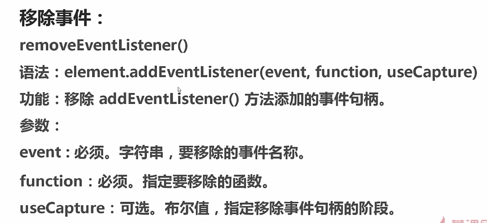

```
<button id='btn'>点击我</button>
<script>
  var btn = document.getElementById('btn');

  //在事件解绑中,不建议使用匿名函数,因为匿名函数无法指定,无法解绑
  //所以,要给函数定义名字

  var hello = function(){
    alert('Hello World');
  }
  //绑定
  btn.addEventListener('click',hello,false);

  //解绑
  btn.removeEventListener('click',hello;

</script>
```

### 事件委托
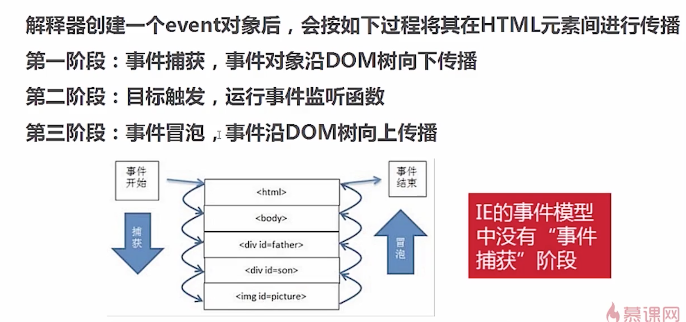

>false : 事件冒泡   (默认false)
>true : 事件捕获


##### 事件冒泡

- 从下往上

```
<button id='btn'>点击我</button>
<script>
  var btn = document.getElementById('btn');
  var hello = function(){
    alert('Hello World');
  }
  //绑定
  btn.addEventListener('click',hello,false);
<script>
```

##### 事件捕获

- 从上往下

```
<button id='btn'>点击我</button>
<script>
  var btn = document.getElementById('btn');
  var hello = function(){
    alert('Hello World');
  }
  //绑定
  btn.addEventListener('click',hello,true);
<script>
```

### 事件委托(利用事件冒泡)

```
<ul id='parent'>
  <li id='one'>1</li>
  <li id='two'>2</li>
  <li id='thr'>3</li>
  <li id='four'>4</li>
</ul>
<script>
  var p = document.getElementById('parent');
  p.addEventListener('click',function(event){
      if(event.target.id == 'one'){
        alert(1);
      }else if(event.target.id == 'two'){
        alert(2);
      }else if(event.target.id == 'thr'){
        alert(3);
      }else if(event.target.id == 'four'){
        alert(4);
      }
  },false);
</script>
```

- 给父系元素绑定事件,子类元素触发后会冒泡!

### Event对象属性与方法

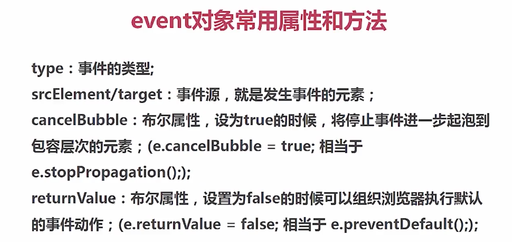
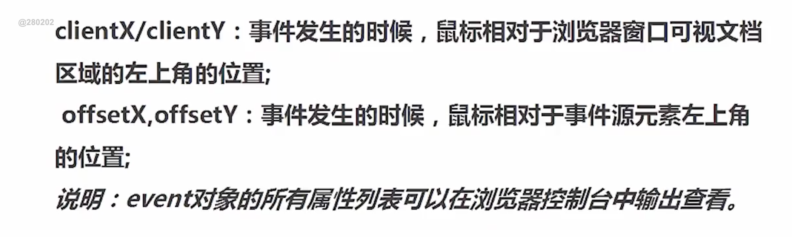

#### event.type 事件类型

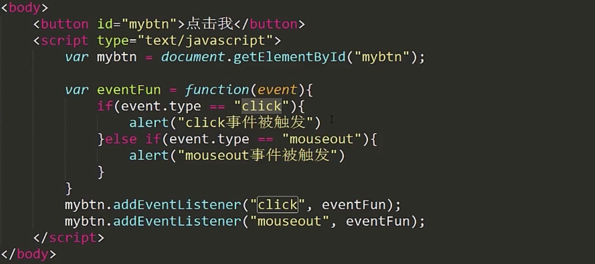

>event.target 事件触发源  
>event.currentTarget 事件绑定源

```
<div id='parent'>点击我
  <button id='child'>点击我</button>
</div>

<script>
  var div = document.getElementById('parent');
  var hello = function(event){
    console.log(event.target);  //<button id='child'>点击我</button>
    console.log(event.currentTarget);//<div id='parent'>点击我...</div>
  }
  //绑定div
  div.addEventListener('click',hello(event),false);
<script>

```
#### 阻止默认行为
```
<a id='a' href='www.baidu.com'>点我</a>
```

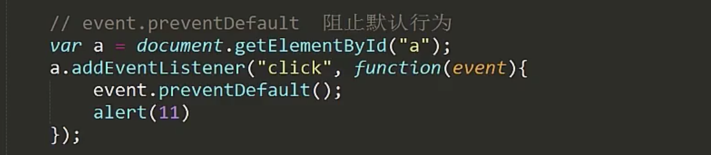
a标签点击后,不会跳转了,因为默认行为被阻止了.

#### 阻止冒泡行为
```
<div id='parent'>
  <div id='child'>点击我</div>
</div>
```
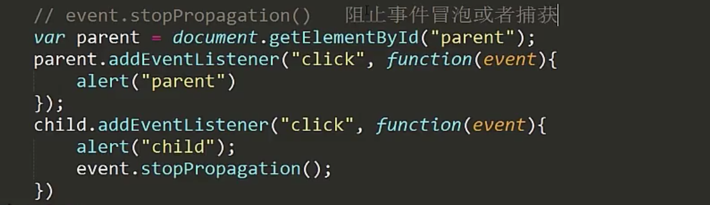
父元素的事件会被阻止

### ClientY, PageY, ScreenY

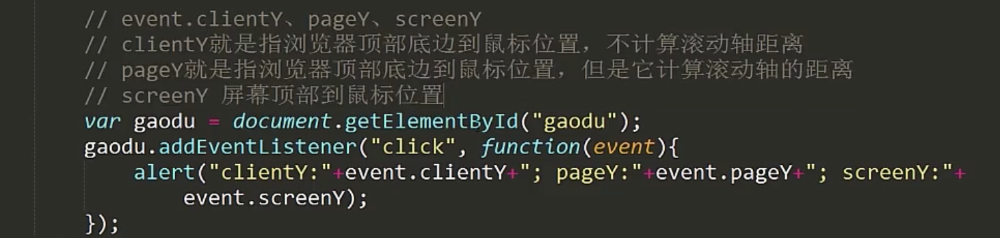

# 事件类型
### 事件类型I
### 事件类型II
### 事件类型III
### 事件类型IV
