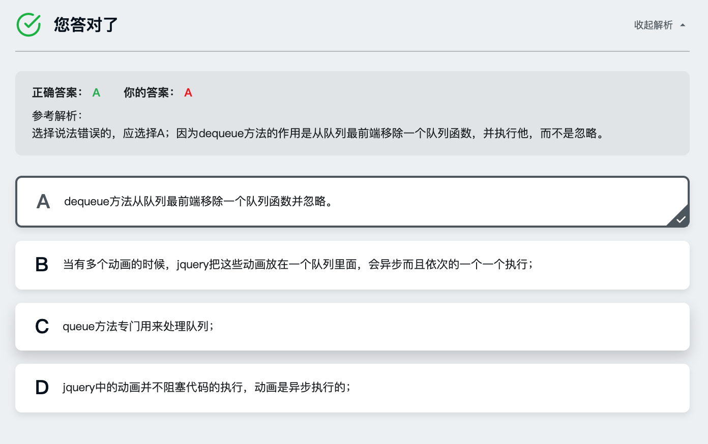

## jQuery动画初识
### jQuery显示和隐藏元素 一

```
show(duration [,easing][,callback])
hide(duration [,easing][,callback])
toggle(duration [,easing][,callback])

//过度时间 duration  fast|normal|slow
//切换效果 easing swing|linear  默认swing

$('.title').click(function(){
  $(this).siblings('.body').toggle('slow',function(){
      console.log('Hello~');
  });
});

```

### jQuery显示和隐藏元素 二

淡入淡出的效果

```
fadeIn(duration[,easing][,callback])
fadeOut(duration[,easing][,callback])
fadeTo(duration[,easing][,callback])

//修改透明度
fadeTo((duration,opacity[,easing][,callback]))

$('.title').click(function(){
    $(this).siblings('.body').fadeTo(1000,0.5,function(){ //一秒钟,透明度0.5
        console.log('动画完成');
    });
});

```
有过度的下拉 上推

```
slideDown(duration [,easing] [callback]);
slideUp(duration [,easing] [callback]);
slideToggle(duration [,easing] [callback]);

$('.title').click(function(){
    $(this).siblings('.body').slideToggle(1000,function(){
        console.log('动画完成');
    });
});
```
### jQuery显示和隐藏元素 三

```
stop(clearQueue,    [,goToEnd]);
     boolean类型    |boolean类型
     true          |true
     停止队列所有动画 |直接完成动画
     false         |false
     直接完成当前动画 |停止完成动画   
     跳转下一个动画   


finish(queue) 完成动画,让元素直接变成结果样式            
```

- finish():所有的堆栈动画直接结束
- stop(true,true):组织当前的动画


### 动画过度 jQuery Easing

### 自定义动画

```
animate(properties,[duration],[easing],[callback])
        对象
        最终CSS状态  时间        效果      回调函数
```

## 动画队列

