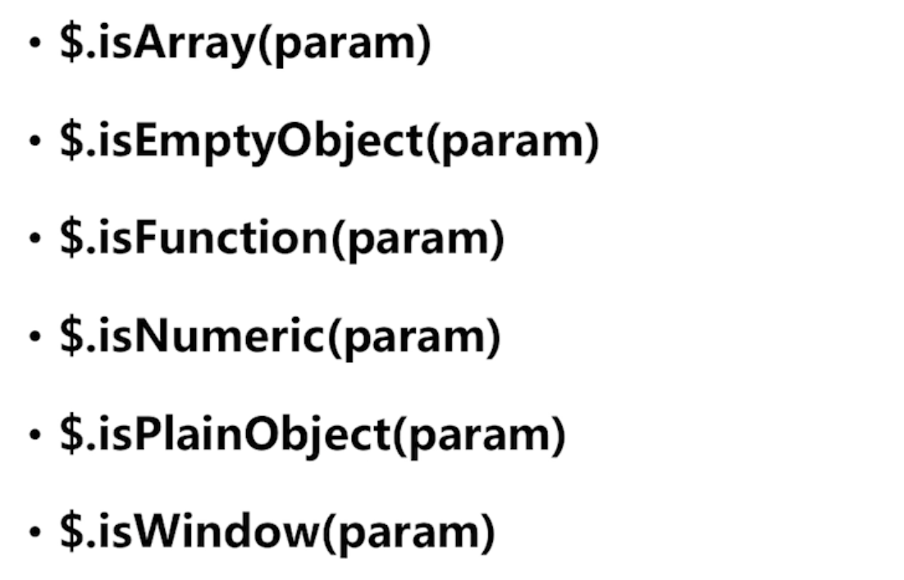

# jQuery常用工具函数

### 和其他JS库一起使用jQuery

练习
修改补全下列代码，使程序不会报错，并在控制台输出This is function one! 和hello。
```
<head>
    <meta charset="UTF-8" />
    <title>Document</title>
</head>
<body>
    <h1 class="h1">hello</h1>
    <script>
        var myFun={
            one:function(){
                console.log("This is function one!");
            },
            two:function(){
                console.log("This is function two!");
            }
        }
        var $=myFun;
    </script>
    <script src="https://cdn.bootcss.com/jquery/3.3.1/jquery.min.js"></script>
    <script>
        // 此处写代码
        jQuery.noConflict();
        $.one();
        $ = jQuery.noConflict(true);
        console.log($("h1").text());
    </script>
</body>
</html>

```

### 处理JS对象和集合

#### 浏览器特性检测
可以使用$.support进行内部属性判断.

或者使用网站:modernizr

#### 处理JS对象和集合 (1)

$.trim(); 去除前后空格  
ES5.1后 字符串自带trim()方法;

循环
ES5.1之后
```
arr.foreach(function(currentValue,index,array){
    currentValue  当前值
    index         当前值索引
    array         当前数组
});
```

jQuery的方式
```
var arr = ['one','two','three'];

$.each(arr,function(index,currentValue){
    console.log(index);
    console.log(currentValue);
});
```

```
$.each(arr,function(index,currentValue){
    if(index === 1){
      return false;   //相当于循环里的break
    }
    console.log(index);
    console.log(currentValue);
});
----------
0
one
```

```
$.each(arr,function(index,currentValue){
    if(index === 1){
      return true;  //相当于循环里的continue;
    }
});
-----------
0
one
2
three
```


数组的过滤

```
var arr = [1,8,4,89,56,37,94,23];
var arr2 = $.grep(arr,function(currentValue,index){
  return currentValue > 10;  //如果大于10 就留下
});  

console.log(arr2);
--------------------
[1,8,4]
```

#### 处理JS对象和集合 (2)
1) $.map() 方法 可以转换数组里的内容

```
var arr = [1,2,3,4];
$.map(arr,function(index,currentValue){
    return currentValue + 1;
});

console.log(arr);
-------
[2,3,4,5]

```

2)平展数组内的内容

```
var arr = ['hello','world'];

var arr2 = $.map(arr,function(index,currentValue){
    return currentValue.split('');
});

console.log(arr2);
---------
['h','e','l','l','o','w','o','r','l','d']
```

$.inArray方法
$.inArray(value,arr);

```
console.log($.inArray(2,[1,2,3,4]));
---------
2
```

$.makeArray(arrObject) 将类数组对象变成数组对象

```
var obj = {
  1:'a',
  2:'b',
  3:'c',
  length:3
}

console.log($.makeArray(obj));
---------
['a','b','c']
```

$.merge(arr1,arr2);

合并两个数组

```
var arr1 = [1,2,3];
var arr2 = [4,5,6];
$.merge(arr1,arr2);
console.log(arr1);
console.log(arr2);
---------
[1,2,3,4,5,6]
[4,5,6]
```

综上,将arr1给合并了

#### 练习
现在有一个数组，我们要将数组中的名字添加编号，要求用map方法实现。

数组：arr1=['Tom','Jane','kangkang','Jasper','Joe']

```
var arr1=['Tom','Jane','kangkang','Jasper','Joe'];
console.log(arr2);
// 此处写代码

var arr2 = $.map(arr1,function(currentValue,index){
    return (index+1) +': '+ currentValue;
});

document.write(arr2);
-----
1: Tom,2: Jane,3: kangkang,4: Jasper,5: Joe

```


#### 处理JS对象和集合 (3)

$.extend(deep,target,[source1,source2,source3]);

#### 处理JS对象和集合 (4)



获取对象类型

$.type(param) 相比 ES的typeof 要准确的多


## 其他工具函数

$.noop

$.contains(container,contained)

$.error('...');  <--自带详细报错信息
