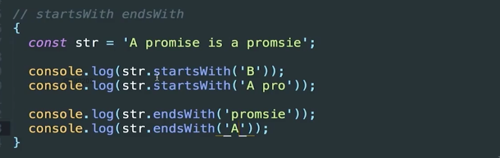

# ES6的扩展

## 字符串扩展
### 模板字符串

传统字符串拼接 和 模板字符串拼接
```
const student = {
  name : 'Bill',
  age : 23,
  sayHello1 : function(){
    console.log('大家好,我是'+this.name.toUpperCase + '我今年'+this.age+'岁');
  }

  sayHello2 : function(){
    console.log(`大家好,我是${this.name.toUpperCase}, 我今年${this.age}岁`);
  }
}

```
进阶使用
已验证
```
const getCourseList = function(){
  return{
    status : true ,
    msg : '获取成功' ,
    data : [{
      id : 1,
      title :  'Vue入门',
      date : 'xxxx-10-09'
    },{
      id : 2,
      title :  'React入门',
      date : 'xxxx-12-09'
    },{
      id : 3,
      title :  'Typescript入门',
      date : 'xxxx-08-09'
    }]
  };
}

function rep (data){
  return data.replace('xxxx',(new Date().getFullYear()));
}

console.log(new Date().getFullYear());

//通过解构赋值获取具体内容

const {status,msg,data:dataList} = getCourseList();
console.log(dataList);
if(status){
  let arr = [];
  dataList.forEach(function({title,date}){ //因为拿到的每个对象,所以对对象进行解构赋值,拿到每一个属性
    arr.push(
      `
        <li><span>课程: ${title} </span><span> ${rep(date)} </span></li>
      `
    );
  });
  let ul = document.createElement('ul');
  ul.innerHTML = arr.join('');
  document.body.appendChild(ul);
} else{
  console.log(msg);
}
```

作业

```
<!DOCTYPE html>
<html>
<head>
    <meta charset="UTF-8">
    <title>模版字符串</title>
</head>
<body>
  <script src="https://cdn.bootcss.com/jquery/1.12.4/jquery.js"></script>
  <script type="text/javascript">
  const tmpl = function() {
      return {
          title: "前端",
          data: [{
              title: '布局基础',
              date: ["html", "css"]
          }, {
              title: '网页特效',
              date: ["javascript", "jquery"]
          }, {
              title: '框架',
              date: ["bootstrap", "vue"]
          }]
      }
  }
  // 补充代码

  const {title,data: dataList} = tmpl();

  let arr = [];
  dataList.forEach(function({title,date:[data1,data2]}){
    arr.push(
      `
          <tr><td>${title}</td><td>${data1}</td><td>${data2}</td></tr>
      `);
  });

  let tb = document.createElement('table');
  tb.border = 'solid 1px black';   //添加Css样式
  tb.innerHTML = arr.join('');
  document.body.appendChild(tb);
    </script>
</body>
</html>
```

### 字符串部分新的方法

padStart  &  padEnd
```
let str = 'i';
let str1 = str.padStart(5,'mooc');  
console.log(str1);

let str2 = str.padEnd(5,'xoxo');
console.log(str2);
```

repeat
```
let str = 'i';
str.repeat(10);
console.log(str);
```

startsWith endsWith

</img>
false  
true  
true  
false  

includes
```
let str = 'this is my promise';
if(str.includes('promise')){
  concole.log('存在');
}
```

### for-of 遍历
```
let words = 'qwertyuiopasdfghjklzxcvbnm'
let map = {A:88,B:89,C:90,...,Z:114};
let str = 'promise';
let srr = '';
for(let word of str){
  if(words.includes(word)) srr += map[word];
}
```

### ES6的unicode表示法
unicode码(点)
```
'u\{1f346}'  <--表示法

'🐶'.codePointAt(0)  --> 128054
'🐶'.codePointAt(0).toString(16);  -->1f436  //转成16进制
```

## 正则扩展
### 正则扩展(u,y 修饰符)

```
console.log(/^\ud83d/.test('\ud83d\udc36'));  //不能识别unicode
console.log(/^\ud83d/u.test('\ud83d\udc36'));  //加u之后,可以识别unicode
```

```
let pattern = /imooc/g;
let pattern2 = /imooc/y;

console.log(pattern.exec('imoocimooc-imooc'));
console.log(pattern.exec('imoocimooc-imooc'));
console.log(pattern.exec('imoocimooc-imooc'));
console.log(pattern.exec('imoocimooc-imooc'));
//------------------
console.log(pattern2.exec('imoocimooc-imooc'));
console.log(pattern2.exec('imoocimooc-imooc'));
console.log(pattern2.exec('imoocimooc-imooc'));

// console结果

["imooc", index: 0, input: "imoocimooc-imooc", groups: undefined]
test2.html:14 ["imooc", index: 5, input: "imoocimooc-imooc", groups: undefined]
test2.html:15 ["imooc", index: 11, input: "imoocimooc-imooc", groups: undefined]
test2.html:16 null

test2.html:18 ["imooc", index: 0, input: "imoocimooc-imooc", groups: undefined]
test2.html:19 ["imooc", index: 5, input: "imoocimooc-imooc", groups: undefined]
test2.html:20 null

```

## 数值扩展
### 数值扩展

isNaN
parseInt
parseFloat
isFinite
isSafeInteger
Number.MAX_SAFE_INTEGER
Number.MIN_SAFE_INTEGER

幂运算

2 ** 2 表示 2的2次方  
console.log(2**2);  // 4
console.log(2**2**0);  // 2 先运算 2 ** 0  再运算 2 ** 1


2进制 8进制 转化为10进制

console.log(Number('0b111',10));
console.log(Number('0o10',10));


## 函数扩展

### 默认参数
```
function demo(a,b=999){
  console.log(a , b);       
}

demo(1)  // 1, 999
------------
function demo(a,b=999 + a){
  console.log(a , b);       
}

demo(); // undefined, NaN
demo(1); // 1    1000

```

同解构赋值一起使用
```
  function demo({name,age = 1} = {name:'adam'}){
    console.log(name, age);
  }

  demo(); //adam  1

  demo({name : 'L'});  // L 1

```

### 剩余参数
```
  function dash(){
    console.log(arguments);
  }

  dash(1,9,45,'loas');
  //Arguments(4) [1, 9, 45, "loas", callee: ƒ, Symbol(Symbol.iterator): ƒ]

-------

  function dash(){
    let arr = [...arguments];
    //let [...arr] = arguments;
    console.log(arr);
  }
  dash(1,9,45,'loas');
  //(4) [1, 9, 45, "loas"]

-------

  function fil(type, ...arr){  //注意, ...arr 必须放在最后一个位置
    console.log(type);
    console.log(arr);
  }

```

reduce 累加器
```
var items = [10, 120, 1000];

// our reducer function
var reducer = function add(sumSoFar, item) { return sumSoFar + item; };

// do the job
var total = items.reduce(reducer, 0);

console.log(total); // 1130

```
Rest（…） 参数搭配的变量是一个数组，该变量将多余的参数放入数组中。我们来定义一个函数，利用 rest 参数，向该函数传入任意数目的参数，然后来求平均数。
```
function rest(...arr){
    return arr.reduce(function(a,b){
        return a + b;
    },0);
}

let res = rest(1,2,3);
console.log(res);

```

```
function Push(arr, ...nums) {
    for(let num of nums){
        arr.push(num);
    }

    return arr;
}
var arr = [];
let res =   Push([5,6], 1, 2, 3)
console.log(res);
```

### 箭头函数

```
  const add1 = (a,b) => a + b;
  //相当于
  const add2 = function(a,b){
    return a + b;
  }

  //当需要处理的内容比较多 一行不够 可以使用大括号
  const add3 = arr =>{
    return arr.reduce(a, b){
      return a + b;
    ,0};
  }

  //当我不需要retrun 怎么办
  const pop = arr => arr.pop();
  pop([1,2,3]);  // 3  自动返回3

  const pop1 = arr => void arr.pop();  
  pop1([1,2,3])  // undefined

```

注意 在扩展运算符中是没有arguments的

```
const app = () => {
  console.log(arguments);
}
app(1,2);    //报错

-------  用剩余参数代替
const app1 = (...args) => console.log(args);
app1(1,2);  //[1,2]

```

this的获取

```
const Bill = {
  sex : 'male',
  age : 20,
  getAge = () => console.log(this.age);

}

Bill.getAge();
//Window {parent: Window, postMessage: ƒ, blur: ƒ, focus: ƒ, close: ƒ, …}


const Vera = {
  sex : 'female',
  age : 29,
  getAge : function(){
    setTimeout(function(){
        console.log(this);  //函数的this指向setTimeout的this 即 Window
    },500);
  }
}

const Vera = {
  sex : 'female',
  age : 29,
  getAge : function(){
    let _this = this;
    setTimeout(()=>{  //箭头函数的this指向函数定义的环境变量的this 即 getAge的this;
      console.log(this);
    },500);
  }
}

Vera.getAge();

{sex: "female", age: 29, getAge: ƒ}
age: 29
getAge: ƒ ()
sex: "female"
__proto__: Object
```

## 对象扩展
### 简洁表示法与属性名表达式

简介表达式

普通ES5 表达式
```
const getInfo = function(){
  const name = 'xiaoming';
  const age = 24;
  return {
    name : name,
    age : age,
    say : function(){
      console.log(this.name, this.age);
    }
  }
}
```

ES6 简洁表达式
```
const getInfo = () => {
  const name = 'xiaoming';
  const age = 24;
  return {
    name,
    age ,
    say(){
      console.log(this.name, this.age);
    }
  };
}

```

属性名表达式

```
const key = 'age';

const Bill = {
  sex : 'male',
  [key] :24,
}
------------
const key = 'age';
const Bill = {
  sex : 'male',
  [`${key}`] : 24
}

```


### 扩展运算符及新方法
### 新的方法

合并对象
```
const abs = {
  a : 1,
  b : 2,
  c : {
    d:4,
    e:5
  }
}

abs.c.d = 7;


const babs = {...abs};

================
console.log(babs);
{a: 1, b: 2, c: {…}}


```

Object.is
```
console.log('NaN-',Object.is(NaN,NaN));  //true
console.log('+0  -0  -',Object.is(+0,-0));  //false
```

Object.assign
```
const abs = {
  a : 1,
  b : 2,
  c :{
    e : 4,
  }
}

let newAbs = Object.assign(abs,{a : 7},{n:90});
console.log(newAbs);
//{a: 7, b: 2, c: {…}, n: 90}
```

Object.keys
Object.values
Object.entries

```
const maps = {
  a:1,
  b:2,
  c:3,
  d:4
}

console.log(Object.keys(maps));  
//(4) ["a", "b", "c", "d"]
console.log(Object.values(maps));
//[1, 2, 3, 4]
console.log(Object.entries(maps));
//(4) [Array(2), Array(2), Array(2), Array(2)]
// 0: (2) ["a", 1]
// 1: (2) ["b", 2]
// 2: (2) ["c", 3]
// 3: (2) ["d", 4]
// length: 4
// __proto__: Array(0)

```

``` __proto__```

```
const obj1 = {
  a : 1;
}

const obj2 = {
  b :2;
}

const obj = Object.create(obj1);
console.log(obj.__proto__); // {a:1}
Object.setProtoOf(obj,obj2);
console.log(obj.__proto__); //{b:2}
```

Object.setProtoOf & super

```
const obj = {name : 'xiaoming'}
const obj1 = {
  say(){
    console.log(`my name is ${super.name}`);
  }
}
Object.setProtoOf(obj1,obj);
obj1.say(); //my name is xiaoming
```
注意!
```
say : function(){....}
        或者
say:()=>{...}  这两种方式都会报错的, 需要使用简介模式!!!
```


Object.getProtoOf

```
const obj1 = {a :'abc'};
const obj = Object.create(obj1);
console.log(obj.__proto__ === obj.getProtoOf); //true
```

## 数组扩展
### 数组扩展

```
const arr1 = [1,2,3];
const arr2 = [4,5,6];
const arr3 = [23,778,90];

const arr =[3,4,5,...arr3];
const arr4 = [...arr1,...arr2,...arr3];
```

ES6新特性 生成器函数

```
function *gun(){
  console.log(1);
  yield 'hi~';
  console.log(2);
  yield 'Joppiu~';
  console.log(3);
  yield 'Yotow~';
}

const arr = [...gun()];  //调用生成器函数
const gunner = *gun();
gunner.next();  //hi~

setTimeout(function(){
  gunner.next();
},1000);

```

```
const arr= [];
for(let i = 0; i<10; i ++){
arr.push(Math.floor(Math.random()*100));
}

arr.sort(function(a,b){
  return b - a;
});

let max = Math.max(...arr);
let min = Math.min(...arr);
console.log(...arr);
console.log(`该数组最大值是${max},最小值是${min}`);
12 82 81 78 74 73 52 34 29 22 6
13 该数组最大值是82,最小值是6
```

### 新的方法

Array.from
Array.of

Array.fill
Array.includes

keys
values
entries

find
