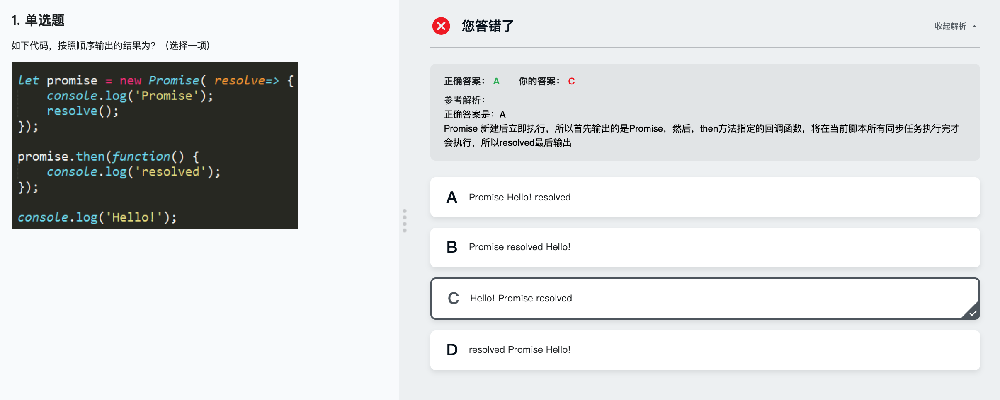

# ES6 Promise

### Promise消息介绍
> Promise对象用于表示一个异步操作的最终状态(完成或失败)以及其返回的值

同步任务会阻塞程序执行(alert,for,......)
异步任务不会阻塞程序执行(setTimeout,fs.readFile,......)

使用Promise(then,catch,finally)

Promise.all & Promise.race

Promise.resolve & Promise.reject

#### 回调与Promise

```
  function pm(){
    return new Promise(resovle => {
        setTimeout(function(){
            resolve();
        },1000);
    });
  };

  pm()
      .then(function(){
          console.log(1);
      })
      .then(function(){
          console.log(2)
      })
      .then()
      .then()......

其中then里面的(function(){
  console.log(1);
  })
就是pm定义里返回的resolve();
```


#### 对比回调 与 Promise的流程控制

```
function moveTo(el,x,y){
  return new Promise(resolve => {
      el.style.transform = `translate(${x}px,${y}px)`;
      //resolve();
      setTimeout(function(){
          resolve();
      },1000);
  });
}

//div
let el = document.querySelector('div');

//button触发动作
document.querySelector('button').addEventListener('click', e => {
    moveTo(el,20,30)
      .then(function(){
          console.log('第一次move');
          return moveTo(el,30,40)})
      .then(function(){
          console.log('第二次move');
          return moveTo(el,40,50)})
      .then(function(){
        console.log('第三次move');})
      .then(function(){
        console.log('第四次move');})
});

Promise代码的健壮性更优秀
```

作业
```
2-4 编程练习
我们来实现一个图片的加载；设置第一张图片加载1s之后加载第二张图片，可参考如下效果图：

http://climg.mukewang.com/5b16558d00011ed506000338.jpg
http://climg.mukewang.com/5b165603000146ca06000338.jpg
http://climg.mukewang.com/5b1656140001c89906000338.jpg

================================================================
<!DOCTYPE html>
<html lang="en" dir="ltr">
  <head>
    <meta charset="utf-8">
    <title></title>
  </head>
  <body>
    <script type="text/javascript">
      let data = {
        url1:'http://climg.mukewang.com/5b16558d00011ed506000338.jpg',
        url2:'http://climg.mukewang.com/5b165603000146ca06000338.jpg',
        url3:'http://climg.mukewang.com/5b1656140001c89906000338.jpg'
      };

      let fillPic = function(url){
        return new Promise(resolve =>{
          let img = new Image();
          img.src = url;
          img.onload = function(){
            document.body.appendChild(img);
          }
          setTimeout(function(){
            resolve();
          },1000);
        });
      }

      fillPic(data.url1)
        .then(function(){
          return fillPic(data.url2);})
        .then(function(){
          return fillPic(data.url3);})

    </script>

  </body>
</html>
```

#### 信任问题

当Promise里的方法执行过一次之后,表明该方法成功了,就不会再执行一次.
```
  function pm(){
    return new Promise(function(){
      resolve();  //执行
      resolve();  //不执行
      });
  }

```

#### 错误处理

- then(resolve,reject)

```
function fun(val){
  return new Promise((resolve,reject)=>{
      if(val){
        resolve({'小子':'阔以蛤!'});
      }else{
        reject('劳资找不到值');
      }
  });
}

fun(false)
  .then((data)=>{
      console.log(data);
  },data=>{
      console.log(data);
  });
```


- catch

```
fun(true)
  .then(()=>{
    console.log('Hello')
    return false;
  })
  .then(()=>{
    console.log(1); //不执行
  })
  .catch(()=>{
    console.log('there is something wrong!');
  })

======================================================

fun(true)
  .then(()=>{
    console.log('Hello')
    return false;
  })
  .then(()=>{
    console.log(1); //不执行
  }, ()=>{
     console.log('wrong !');
    })
  .catch(()=>{
    console.log('there is something wrong!');
  })

```

- finally

```
fun(true)
  .then(()=>{
    console.log('Hello')
    return false;
  })
  .then(()=>{
    console.log(1);
  })
  .then(()=>{
    console.log('there is something wrong!');
  })
  .finally((=>{
    console.log(1000);
  })

```


#### Promise的三种状态

>pending  进行中     
>fulfilled   成功     
>rejected   失败     

状态的改变不可逆,一旦决议就不能再修改

```
              ---> fulfilled
pending  
              ---> rejected

```
#### Promise.all()

> Promise.all方法可以把多个Promise实例,包装成一个新的Promise实例
> Promise.all([promise1,promise2]): Promise

```
  //模拟 需要多个请求的数据 才能进行下一步操作
  function data1(){
    return new Promise((resolve,reject)=>{
      setTimeout(()=>{
        console.log('第一条数据加载成功');
        resolve('data1');
        },1000)
      });
  }

  function data2(){
    return new Promise((resolve,reject)=>{
      setTimeout(()=>{
        console.log('第二条数据加载成功');
        resolve('data2');
        },1000)
      });
  }

  function data3(){
    return new Promise((resolve,reject)=>{
      setTimeout(()=>{
        console.log('第三条数据加载成功');
        resolve('data3');
        },1000)
      });
  }

  function data4(){
    return new Promise((resolve,reject)=>{
      setTimeout(()=>{
        console.log('第四条数据加载成功');
        reject('Err data4');
        },500)
      });
  }

let p = Promise.all([getData1(),getData2(),getData3(),getData4()]);
let p1 = Promise.all([getData1(),getData2(),getData3()]);

p.then(arr=>{
    console.log(arr);
  },e=>{
    console.log(e);
});

p1.then(arr=>{
    console.log(arr);
  },e=>{
    console.log(e);
});

let pb = Promise.all([]);
pb.then(arr=>{
  console.log(arr)
  },e=>{
    console.log(e);
    });

```

#### Promise.race

- 相当于 竞赛, 谁先跑完,谁返回结果,和all全部跑完再返回结果不一样.

```
function data1(){
  return new Promise((resolve,reject)=>{
    setTimeout(()=>{
      console.log('第一条数据加载成功');
      resolve('data1');
      },1000)
    });
}

function data2(){
  return new Promise((resolve,reject)=>{
    setTimeout(()=>{
      console.log('第二条数据加载失败');
      reject('data2');
      },500)
    });
}

function data3(){
  return new Promise((resolve,reject)=>{
    setTimeout(()=>{
      console.log('第三条数据加载成功');
      resolve('data3');
      },1000)
    });
}

let pr = Promise.race([data1(),data2(),data3()]);

pr.then((arr)=>{
  console.log(arr);
  });

```

#### Promise.resolve() 与 Promise

- 传递一个普通的值(这两种方法没有区别)

```
let p1 = new Promise(resolve =>{
  resolve('成功');
});

let p2 = Promise.resolve('成功');
```

- 传递一个Promise实例

```
//实例  
let promiss = new Promise(resolve =>{
    resolve('Yeah');
});

//传递  
let p = Promise.resolve(promiss);

p.then(data =>{console.log(data)})

console.log(p === promiss);

```

- 传递一个thenable

```
let obj = {
  then(cd){
    console.log('我被执行了');
    cd('哈')
    },
    oth(){
      console.log('我被抛弃了');
    }
}

Promise.resolve(obj).then(data =>{
    console.log(data);
});
```

- 把同步任务转成异步任务

```
  function crSyn(syncTask){
    return Promise.resolve(syncTask).then(syncTask =>syncTask());
  }

  crSyn(()=>{
      console.log('我是异步任务!');
      return 2 +3;
  }).then(res =>{
    console.log(res);
   });
```

### 小案例

```
//图片地址
const imgs = ['https://pic.36krcnd.com/avatar/201712/19082638/3cmf5bqmm6aowdos.jpg!1200',
            'https://pic4.zhimg.com/v2-3be05963f5f3753a8cb75b6692154d4a_1200x500.jpg',
            'https://up.enterdesk.com/edpic/41/fa/d9/41fad9881853f046b129d70e2f02065d.jpg'];


//加载方法
const loadImg = (src) => {
  return new Promise((resolve,reject)=>{
      const img = new Image();
      img.src = src;
      img.onload = ()=>{
        resolve(img);
      }
      img.onerror = (e)=>{
        reject(e);
      }
  });
};

//进行处理
Promise.all(imgs.map(src => loadImg(src))).then((arr)=>{
    console.log(arr);
    arr.forEach((img)=>{
        document.body.appendChild(img);
    });
});
```
