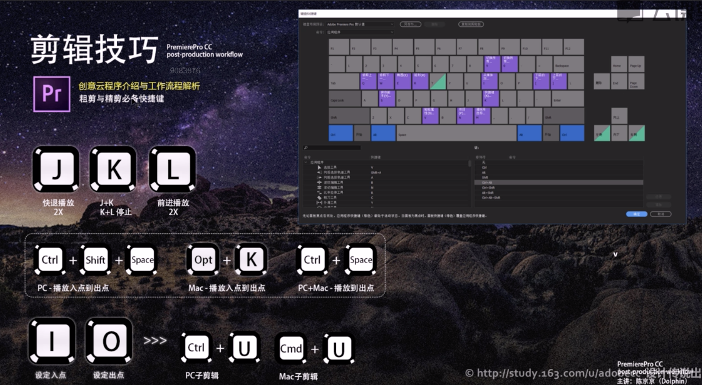

# 后期处理流程

- 素材整理分类归档
- 粗剪/精剪
- 测彩矫正
- 音效设计
- 图形设计
- 发布

### 1-准备流程-素材分类和归档

* 收录(不破坏原始素材,可以对大的素材进行转码)

- 对文件名称进行编排,方便查找

### 2-粗剪流程

- 制作子剪辑

注意 在新建序列的时候要查看自己相机的硬件规格,去选择对应的参数. 在未知视频格式的情况下(别人给的视频)默认选择diglr格式,之后如果出现视频序列不匹配字样,点击更改视频序列.

