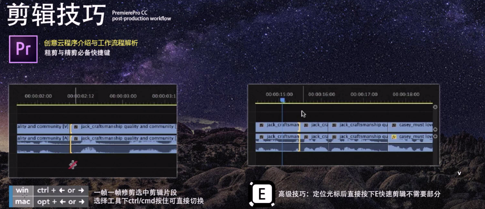
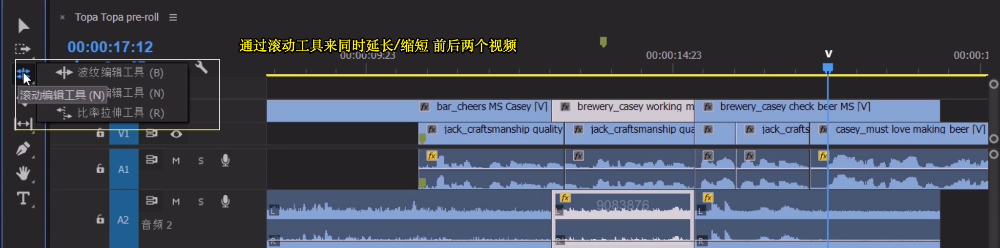
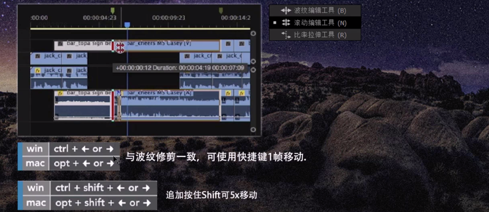
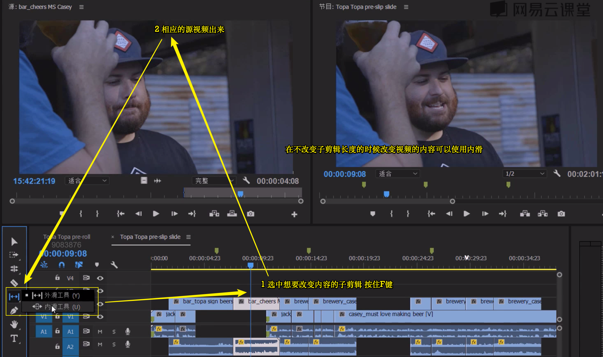
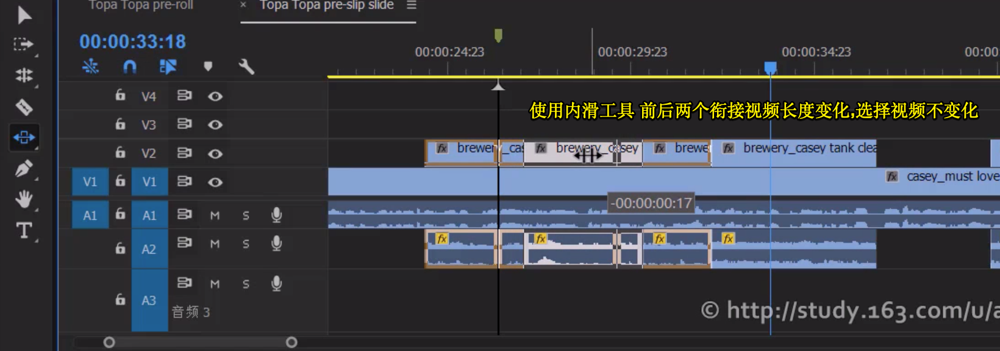
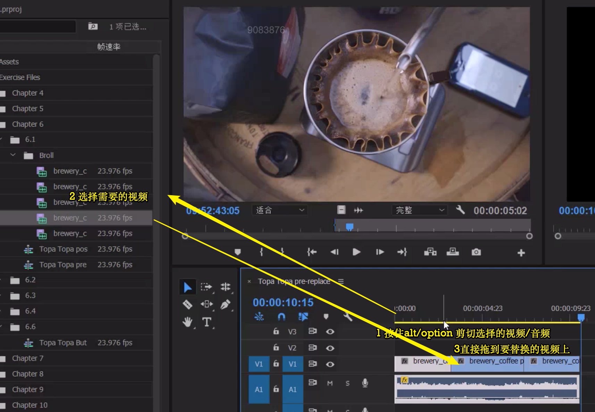
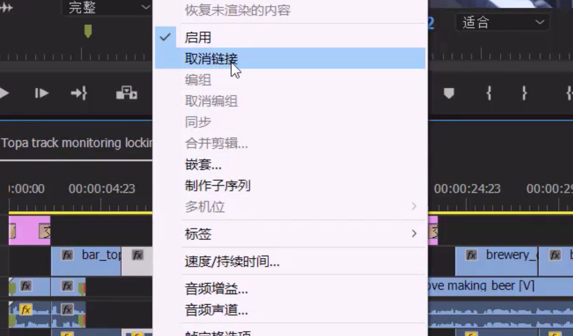
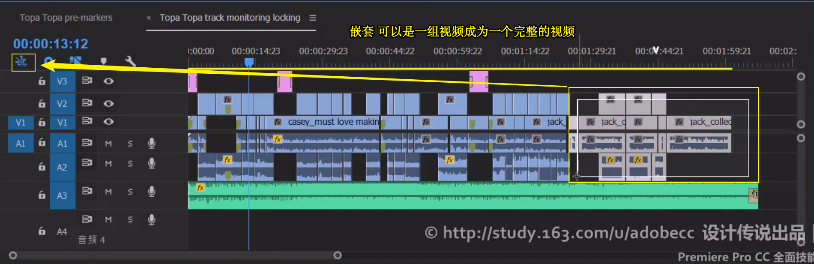

# 精剪流程

### 波纹编辑

E键 : 光标和选择高亮部分会被截切掉

### 内滑外滑

不更改前后视频长度, 只更改选择视频的入出点 使用外滑 下面图片记错

也可以选择多个视频实现内滑

替换视频  cmd+k (knife) 切换成剃刀

选中时间轴/片段 双击M键 对选中的素材添加标记

取消链接 表示 音频和 视频是链接在一起的

选中一组视频右击 可以找到

